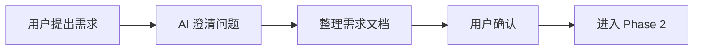
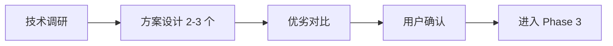
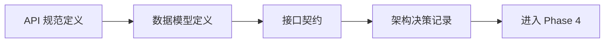
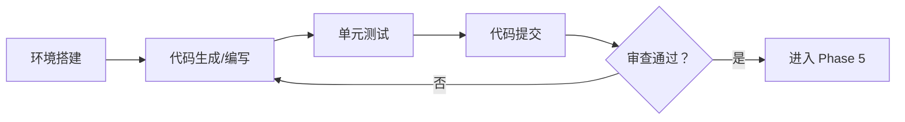
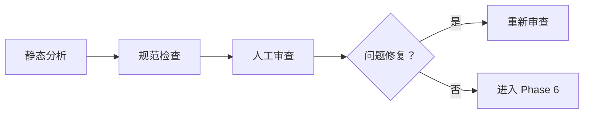
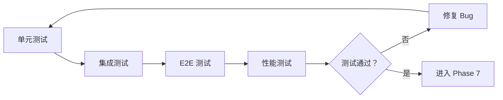
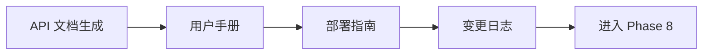
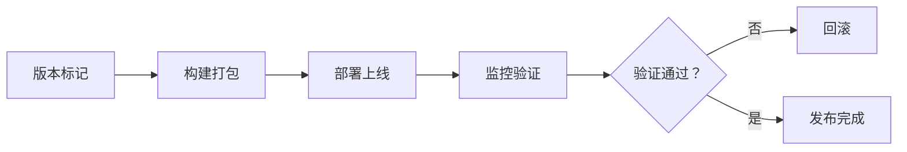

# AI 智能体工作流完整指南

> 基于 zn-agent-assets 资源的从开发到测试全流程实践

JW|**版本**: v1.2  
YJ|**更新日期**: 2026-03-06
**适用平台**: Nova CLI, OpenCode

---

## 目录

1. [工作流总览](#工作流总览)
2. [Phase 1: 需求分析](#phase-1-需求分析)
3. [Phase 2: 方案设计](#phase-2-方案设计)
4. [Phase 3: 规范定义](#phase-3-规范定义)
5. [Phase 4: 开发实现](#phase-4-开发实现)
6. [Phase 5: 代码审查](#phase-5-代码审查)
7. [Phase 6: 测试验证](#phase-6-测试验证)
8. [Phase 7: 文档生成](#phase-7-文档生成)
9. [Phase 8: 部署发布](#phase-8-部署发布)
10. [资源使用速查表](#资源使用速查表)
11. [Openspec 资源增补 TODO](#openspec-资源增补-todo)
12. [最佳实践](#最佳实践)

---

## 工作流总览

### 核心理念

**Context Window = RAM (volatile), Filesystem = Disk (persistent)**

- 上下文窗口是易失性内存，文件系统是持久化存储
- 所有重要信息必须写入文件，不要依赖对话上下文
- 使用 `planning-with-files` 技能管理复杂任务

### 完整工作流图

```
┌────────────────────────────────────────────────────────────────────┐
│                     AI 智能体完整工作流 v1.0                        │
├────────────────────────────────────────────────────────────────────┤
│                                                                    │
│  ┌──────────┐   ┌──────────┐   ┌──────────┐   ┌──────────┐       │
│  │ Phase 1  │ → │ Phase 2  │ → │ Phase 3  │ → │ Phase 4  │       │
│  │ 需求分析  │   │ 方案设计  │   │ 规范定义  │   │ 开发实现  │       │
│  └──────────┘   └──────────┘   └──────────┘   └──────────┘       │
│       ↓              ↓              ↓              ↓               │
│  ┌──────────┐   ┌──────────┐   ┌──────────┐   ┌──────────┐       │
│  │ Phase 5  │ ← │ Phase 6  │ ← │ Phase 7  │ ← │ Phase 8  │       │
│  │ 代码审查  │   │ 测试验证  │   │ 文档生成  │   │ 部署发布  │       │
│  └──────────┘   └──────────┘   └──────────┘   └──────────┘       │
│                                                                    │
│  迭代循环：Phase 5 → Phase 4 (审查不通过则返工)                       │
│  迭代循环：Phase 6 → Phase 4 (测试失败则修复)                        │
└────────────────────────────────────────────────────────────────────┘
```

### 快速开始

#### 场景 1: 新功能开发

```bash
# 1. 启动任务规划
/planning:start new-feature

# 2. 需求分析 (Phase 1)
"我需要实现用户登录功能"
→ 使用 planning-with-files 分析需求
→ 输出需求文档

# 3. 方案设计 (Phase 2)
→ 使用 plan-agent 设计方案
→ 对比 2-3 个技术方案

TT|→ 使用 docx 编写 API 规范
WR|→ 使用 openapi-typescript + swagger-cli 生成 OpenAPI 文档
# 5. 开发实现 (Phase 4)
→ 使用 zn-frontend-dev 指导前端开发
→ 使用 git-master 提交代码

# 6. 代码审查 (Phase 5)
→ 使用 git-master 审查提交
→ (未来) 使用 code-review-agent 自动审查

# 7. 测试验证 (Phase 6)
→ 使用 webapp-testing 运行 E2E 测试
→ (未来) 使用 test-generator 生成单元测试

# 8. 文档生成 (Phase 7)
→ 使用 doc-coauthoring 编写用户文档

# 9. 部署发布 (Phase 8)
→ 使用 commit 命令自动提交
→ 使用 git-master 打标签

# 10. 完成任务
/planning:complete
```

#### 场景 2: Bug 修复

```bash
# 1. 启动任务
/planning:start bugfix-login-issue

# 2. 问题定位 (Phase 1+2)
→ 使用 planning-with-files 记录问题分析
→ 定位问题根因

# 3. 修复方案 (Phase 2)
→ 提出修复方案
→ 评估影响范围

# 4. 实施修复 (Phase 4)
→ 修改代码
→ 编写回归测试

# 5. 验证 (Phase 5+6)
→ 代码审查
→ 运行测试

# 6. 提交 (Phase 8)
→ git-master 提交
→ commit 生成提交信息
TQ|```

QM|#### 场景 3: 多 Agent 协作（数字员工团队）
VS|
KM|基于 task-with-files 的多 Agent 协作工作流，支持 7×24 小时不间断工作的数字员工团队。

BV|```bash
HB|# 1. 团队负责人启动任务规划
QM|/planning:start digital-employee-team

ZJ|# 2. 定义数字员工团队配置
YY|→ 使用 task-with-files 创建团队规划
→ 定义每个数字员工的角色和职责：
   - 需求分析师 Agent：处理用户需求
   - 开发者 Agent：编写代码
   - 测试 Agent：执行测试
   - 运维 Agent：部署和监控

VB|# 3. 任务分发（支持异步协作）
XH|→ 主 Agent 将任务分解为子任务
→ 分发给不同的数字员工处理
→ 每个数字员工使用独立的 task-with-files 工作区

HB|# 4. 数字员工并行工作
QT|→ 需求分析师：分析需求，生成文档
ZJ|→ 开发者：编写代码，提交 PR
TZ|→ 测试 Agent：运行测试，生成报告
JH|→ 运维 Agent：部署上线，监控状态

XV|# 5. 任务汇总与协调
QX|→ 主 Agent 汇总各数字员工的工作结果
→ 处理跨 Agent 的依赖和冲突
→ 生成整体工作报告

VT|# 6. 7×24 小时不间断工作
HZ|→ 数字员工可以 24 小时运行
→ 夜间任务自动排队等待
→ 次日自动继续执行

YY|/planning:complete
NM|```

RS|##### 多 Agent 协作架构
VS|
HV|```
KM|┌─────────────────────────────────────────────────────────────┐
QM|│                    数字员工协作平台                             │
KM|├─────────────────────────────────────────────────────────────┤
QM|│                                                              │
KM|│    ┌──────────────┐                                          │
KM|│    │  主 Agent    │ ←── 任务协调与汇总                        │
KM|│    │ (Coordinator)│                                          │
KM|│    └──────┬───────┘                                          │
KM|│           │                                                  │
KM|│    ┌─────┴─────┬──────────────┬──────────────┐             │
KM|│    ▼            ▼              ▼              ▼             │
KM|│ ┌────────┐ ┌────────┐ ┌────────┐ ┌────────┐ ┌────────┐      │
KM|│ │需求分析│ │开发   │ │测试   │ │运维   │ │文档   │      │
KM|│ │Agent   │ │Agent   │ │Agent   │ │Agent   │ │Agent   │      │
KM|│ └────┬───┘ └────┬───┘ └────┬───┘ └────┬───┘ └────┬───┘      │
KM|│      │          │          │          │          │            │
KM|│      ▼          ▼          ▼          ▼          ▼            │
KM|│  ┌────────────────────────────────────────────────────┐     │
KM|│  │           共享知识库 & 任务状态同步                   │     │
KM|│  └────────────────────────────────────────────────────┘     │
KM|│                                                              │
KM|└─────────────────────────────────────────────────────────────┘
VT|```

VB|##### 数字员工工作模式
VS|
BV|###### 1. 按职责分类
MH|
QV|```
KM|┌────────────────┬────────────────────────────────────────────┐
KM|│ 数字员工类型   │ 职责描述                                     │
KM|├────────────────┼────────────────────────────────────────────┤
KM|│ 需求分析师     │ 需求收集、分析、文档编写                     │
KM|│ 开发者        │ 代码编写、单元测试、代码审查                  │
KM|│ 测试工程师    │ 功能测试、性能测试、自动化测试                │
KM|│ 运维工程师    │ 部署上线、监控报警、故障恢复                  │
KM|│ 文档工程师    │ API 文档、用户手册、技术文档                  │
KM|│ 架构师       │ 方案设计、技术选型、架构评审                   │
KM|└────────────────┴────────────────────────────────────────────┘
HB|```

QP|###### 2. 7×24 小时工作流程
MH|
HV|```
KM|时间线示例：

KM|09:00 │ 需求分析师 Agent 接收新需求
KM|      │ ↓
KM|10:30 │ 需求分析完成，生成需求文档
KM|      │ ↓ (自动触发)
KM|10:31 │ 开发者 Agent 开始编码
KM|      │ ↓ (并行处理)
KM|12:00 │ 测试 Agent 同时进行测试用例评审
KM|      │ ↓
KM|14:00 │ 开发者 Agent 完成编码，提交 PR
KM|      │ ↓ (等待人工 Code Review)
KM|18:00 │ 下班时间，PR 等待 Review
KM|      │ ↓
KM|22:00 │ (夜间) 运维 Agent 监控系统状态
KM|      │ ↓
KM|次日 09:00 │ Code Review 通过，自动合并
KM|      │ ↓
KM|10:00  │ 部署上线，运维 Agent 执行
KM|      │ ↓
KM|11:00  │ 测试 Agent 运行回归测试
KM|      │ ↓
KM|12:00  │ 任务完成，生成报告
VT|```

NP|##### task-with-files 多工作区配置
VS|
HV|每个数字员工拥有独立的工作区：
HH|```bash
TT|# 目录结构
VP|.agent_working_dir/
QV|├── current_task.json              # 当前任务指示器
VM|├── team_config.json               # 团队配置
KM|├── task_requester_2026-03-06/     # 需求分析师工作区
KM|│   ├── task_plan.md
KM|│   ├── findings.md
KM|│   └── progress.md
KM|├── task_developer_2026-03-06/     # 开发者工作区
KM|│   ├── task_plan.md
KM|│   ├── findings.md
KM|│   └── progress.md
KM|├── task_tester_2026-03-06/        # 测试工程师工作区
KM|│   ├── task_plan.md
KM|│   ├── findings.md
KM|│   └── progress.md
KM|└── task_devops_2026-03-06/        # 运维工程师工作区
KM|    ├── task_plan.md
KM|    ├── findings.md
KM|    └── progress.md
NP|```

NP|##### 协作机制
VS|
QV|1. **任务队列**: 主 Agent 将任务分解为子任务，加入队列
VT|2. **事件驱动**: 一个 Agent 完成任务后，自动触发下游 Agent
HV|3. **状态同步**: 所有 Agent 共享任务状态，避免重复工作
NK|4. **冲突处理**: 主 Agent 协调资源竞争和依赖关系
VT|5. **错误恢复**: 单个 Agent 失败不影响整体流程

NP|##### 最佳实践
VS|
MP|✅ **DO**:
HV|- 为每个数字员工明确定义职责边界
TH|- 使用共享知识库存储团队知识
ZY|- 设置任务优先级和超时时间
HM|- 建立人工介入机制（关键决策需要人工确认）

SN|❌ **DON'T**:
JV|- 不要让多个 Agent 同时处理同一任务
HV|- 不要忽略 Agent 间的依赖关系
JV|- 不要完全无人值守（安全性是关键）
VT|- 不要忽视日志和监控

PQ|##### 适用场景
VS|
HV|1. **大规模需求处理**: 同时处理多个需求
HV|2. **DevOps 流水线**: 自动化持续集成/部署
HV|3. **多模块并行开发**: 多个模块同时开发
HV|4. **全流程自动化**: 从需求到上线全自动化

YM|---

---

## Phase 1: 需求分析

### 目标
将模糊的用户需求转化为清晰、可执行的技术需求

### 输入
- 用户口头需求
- 业务文档
- 用户故事草稿

### 输出
- ✅ 需求规格说明书 (Word/PDF)
- ✅ 用户故事地图 (Excel)
- ✅ 验收标准清单

### 使用工具

| 工具 | 用途 | 命令/技能 |
|------|------|-----------|
| `planning-with-files` | 结构化需求分析 | 自动激活 |
| `doc-coauthoring` | 协作用户故事编写 | 引导式对话 |
| `xlsx` | 需求追踪矩阵 | Excel 处理 |

### 工作流程



#### Step 1: 需求收集

**使用 `planning-with-files` 技能**:

```markdown
# Findings & Decisions

## Requirements
- 用户原始需求：[记录用户原话]

## Clarifying Questions
- Q1: [AI 提出的问题]
  A1: [用户回答]
- Q2: [AI 提出的问题]
  A2: [用户回答]

## User Stories
- 作为 [角色], 我想要 [功能], 以便 [价值]
- ...
```

#### Step 2: 需求分析

**使用 `doc-coauthoring` 技能**:

```
阶段 1: 上下文转移
- 用户提供背景信息
- AI 理解业务场景

阶段 2: 迭代精炼
- AI 提出初步需求文档
- 用户反馈
- AI 修正

阶段 3: 验证
- AI 确认需求完整性
- 用户最终确认
```

#### Step 3: 需求追踪矩阵

**使用 `xlsx` 技能**:

| 需求 ID | 需求描述 | 优先级 | 验收标准 | 状态 |
|--------|----------|--------|----------|------|
| REQ-001 | 用户能够使用邮箱注册 | P0 | 1. 输入邮箱 2. 输入密码 3. 收到验证邮件 | 待开发 |
| REQ-002 | 用户能够使用手机号注册 | P1 | 1. 输入手机号 2. 输入验证码 3. 设置密码 | 待开发 |

### 最佳实践

✅ **DO**:
- 问清楚"为什么"，理解业务目标
- 记录所有假设和依赖
- 区分"必须有"和"最好有"
- 量化验收标准（响应时间 < 200ms）

❌ **DON'T**:
- 不要假设用户需求
- 不要忽略边界情况
- 不要跳过用户确认环节
- 不要使用模糊词汇（"快速"、"友好"）

### 模板文件

```markdown
# 需求规格说明书

## 1. 项目背景
[描述业务背景和项目目标]

## 2. 用户角色
- 角色 A: [描述]
- 角色 B: [描述]

## 3. 功能需求
### 3.1 [功能名称]
- 描述：[功能描述]
- 优先级：P0/P1/P2
- 验收标准：
  1. [标准 1]
  2. [标准 2]

## 4. 非功能需求
- 性能：[响应时间、并发量]
- 安全：[认证、授权、加密]
- 可用性：[SLA 目标]

## 5. 约束条件
- 技术约束：[必须使用的技术栈]
- 时间约束：[交付日期]
- 资源约束：[人力、预算]
```

---

## Phase 2: 方案设计

### 目标
将需求转化为技术方案，评估多种方案的优劣

### 输入
- 需求规格说明书
- 现有技术栈约束

### 输出
- ✅ 技术方案设计文档
- ✅ 架构设计图
- ✅ 技术选型说明
- ✅ 风险评估报告

### 使用工具

| 工具 | 用途 | 命令/技能 |
|------|------|-----------|
| `plan-agent` | 专业方案规划 | 自动激活 |
| `planning-with-files` | 方案对比分析 | 自动激活 |
| `xlsx` | 方案对比矩阵 | Excel 处理 |

### 工作流程



#### Step 1: 技术调研

**使用 `planning-with-files` 技能**:

```markdown
# Findings & Decisions

## Research Findings
- 现有技术栈：[React, TypeScript, Node.js]
- 类似功能参考：[代码库路径、文档链接]
- 第三方服务：[需要集成的 API]

## Constraints
- 必须兼容：[现有系统]
- 不能使用：[受限技术]
```

#### Step 2: 方案设计

**使用 `plan-agent` 技能**:

```
"请设计 2-3 个技术方案来实现 [功能]"

→ AI 输出:
方案 A: [方案名称]
  - 技术栈：[技术选型]
  - 架构：[架构图描述]
  - 优点：[优势列表]
  - 缺点：[劣势列表]
  - 工作量：[人天估算]

方案 B: [方案名称]
  - ...
```

#### Step 3: 方案对比矩阵

**使用 `xlsx` 技能**:

| 评估维度 | 方案 A | 方案 B | 方案 C |
|----------|--------|--------|--------|
| 开发成本 | 5 人天 | 3 人天 | 8 人天 |
| 维护成本 | 低 | 中 | 低 |
| 性能 | 高 | 中 | 高 |
| 扩展性 | 高 | 低 | 高 |
| 风险 | 低 | 中 | 低 |
| **综合评分** | ⭐⭐⭐⭐ | ⭐⭐⭐ | ⭐⭐⭐⭐⭐ |

### 最佳实践

✅ **DO**:
- 至少提供 2 个方案供选择
- 明确每个方案的 trade-offs
- 量化评估标准（成本、性能、风险）
- 记录决策理由（未来回溯）

❌ **DON'T**:
- 不要只提供一个方案（没有选择）
- 不要隐藏方案缺点
- 不要忽略长期维护成本
- 不要跳过用户确认

### 模板文件

```markdown
# 技术方案设计

## 1. 方案概述
[简述推荐方案]

## 2. 方案对比
### 方案 A: [名称]
**架构**:
[架构图或描述]

**技术栈**:
- 前端：[技术]
- 后端：[技术]
- 数据库：[技术]

**优点**:
1. [优点 1]
2. [优点 2]

**缺点**:
1. [缺点 1]
2. [缺点 2]

**工作量估算**: [X 人天]

### 方案 B: [名称]
[同上结构]

## 3. 推荐方案
**推荐**: 方案 [X]

**理由**:
1. [理由 1]
2. [理由 2]

**风险评估**:
- 风险 1: [描述] - 应对：[措施]
- 风险 2: [描述] - 应对：[措施]
```

---

## Phase 3: 规范定义

### 目标
将技术方案转化为具体规范，指导开发实施

### 输入
- 技术方案设计文档
- 需求规格说明书

### 输出
- ✅ API 接口规范（OpenAPI/Swagger）
- ✅ 数据模型定义（JSON Schema）
- ✅ 架构决策记录（ADR）
- ✅ 接口契约文档

### 使用工具

| 工具 | 用途 | 状态 |
|------|------|------|
RM|| `docx` | 编写 Word 格式规范文档 | ✅ 已有 |
JZ|| `openapi-typescript` | OpenAPI → TypeScript 类型生成 | ✅ npm 安装 |
HQ|| `swagger-cli` | OpenAPI 规范验证 (开源) | ✅ npm 安装 |
MK|| `redoc` / `swagger-ui` | API 文档展示 | ✅ npm 安装 |
PX|| `adr-tools` | ADR 管理 (开源) | ✅ npm 安装 |

### 工作流程



### Step 1: API 规范定义

**当前方式 (手动)**:
```markdown
# API 接口文档

## POST /api/v1/users

### 请求
**Headers**:
```json
{
  "Content-Type": "application/json",
  "Authorization": "Bearer <token>"
}
```

**Body**:
```json
{
  "email": "string (required)",
  "password": "string (required)",
  "phone": "string (optional)"
}
```

### 响应
**201 Created**:
```json
{
  "id": "number",
  "email": "string",
  "createdAt": "string (ISO 8601)"
}
```

**400 Bad Request**:
```json
{
  "code": "VALIDATION_ERROR",
  "message": "Invalid email format",
  "details": [...]
}
```
```
BV|
JS|**推荐方式 (使用开源工具)**:
VY|```yaml
KM|# 使用 openapi-typescript 生成 OpenAPI 规范
TT|openapi: 3.0.0
TZ|info:
  XV|  title: User API
  HY|  version: 1.0.0
RX|paths:
  MY|  /api/v1/users:
    KB|    post:
      SJ|      summary: Create user
      YW|      requestBody:
        ZZ|        required: true
        PX|        content:
          MT|          application/json:
            TR|            schema:
              XK|              $ref: '#/components/schemas/UserCreate'
      YJ|      responses:
        RH|        '201':
          TX|          description: Created
          PX|          content:
            MT|            application/json:
              TR|              schema:
                VB|                $ref: '#/components/schemas/User'
NV|```

### Step 2: 数据模型定义

**当前方式 (手动)**:
```typescript
// TypeScript 类型定义
interface User {
  id: number;
  email: string;
  password: string;
  phone?: string;
  createdAt: Date;
  updatedAt: Date;
}
SS|```

JS|**推荐方式 (使用开源工具)**:
YP|```json
WM|// JSON Schema
JT|{
SM|  "$schema": "http://json-schema.org/draft-07/schema#",
TH|  "title": "User",
WZ|  "type": "object",
VW|  "properties": {
HK|    "id": { "type": "number" },
KQ|    "email": { "type": "string", "format": "email" },
VQ|    "password": { "type": "string", "minLength": 8 },
NN|    "phone": { "type": "string", "pattern": "^\\+?[1-9]\\d{1,14}$" },
VW|    "createdAt": { "type": "string", "format": "date-time" },
YX|    "updatedAt": { "type": "string", "format": "date-time" }
VS|  },
JT|  "required": ["id", "email", "password", "createdAt", "updatedAt"]
VZ|}
YT|```

VB|**使用 json-schema-to-typescript 生成 TypeScript 类型**:
HH|```bash
MH|json-schema-to-typescript user.schema.json -o user.types.ts
QM|```

### Step 3: 架构决策记录 (ADR)

**模板**:
```markdown
# ADR 001: 选择 PostgreSQL 作为数据库

## 状态
Accepted

## 背景
我们需要选择一个关系型数据库来存储用户数据。

## 决策
使用 PostgreSQL 14.x 作为主要数据库。

## 理由
1. 支持 JSON 字段，灵活性高
2. 社区活跃，文档丰富
3. 团队熟悉度高
4. 支持事务和 ACID

## 后果
### 正面
- 数据一致性好
- 查询能力强

### 负面
- 需要 DBA 维护
- 水平扩展复杂

JM|```

VZ|**使用 adr-tools 管理 ADR**:
HH|```bash
YH|# 初始化 ADR 目录
JQ|adr init doc/adr

KB|# 创建新 ADR
WB|adr new 选择 PostgreSQL 作为数据库

RR|# 列出所有 ADR
QV|adr list

NP|# 查看 ADR 内容
MT|doc/adr/0001-select-postgresql-as-database.md
QM|```

### 最佳实践

✅ **DO**:
- API 规范先行于开发
- 数据模型明确定义约束
- 记录所有架构决策及理由
- 规范文档版本管理

❌ **DON'T**:
- 不要边开发边设计 API
- 不要使用模糊的数据类型
- 不要忽略错误处理规范
- 不要跳过团队评审

---

## Phase 4: 开发实现

### 目标
根据规范编写高质量代码

### 输入
- 规范文档（API、数据模型）
- 技术方案设计

### 输出
- ✅ 源代码
- ✅ 单元测试用例
- ✅ 代码注释
- ✅ Git 提交记录

### 使用工具

| 工具 | 用途 | 命令/技能 |
|------|------|-----------|
| `zn-frontend-dev` | 前端开发指导 | 技能激活 |
| `zn-plugin-dev` | 插件开发指导 | 技能激活 |
| `harmony-dev` | 鸿蒙应用开发 | 技能激活 |
| `git-master` | Git 版本控制 | 技能激活 |
| `code-generator` | 代码模板生成 | ❌ 待开发 |

### 工作流程



### Step 1: 环境搭建

```bash
# 使用 zn-cli 脚手架创建项目
zn-cli create my-app --template react-ts

# 安装依赖
pnpm install

# 配置开发环境
pnpm run dev
```

### Step 2: 代码编写

**使用 `zn-frontend-dev` 技能**:

```
"我需要实现一个用户登录表单，使用 Ant Design Mobile"

→ AI 指导:
1. 创建组件文件结构
2. 使用 Ant Design Mobile 的 Form 组件
3. 实现表单验证逻辑
4. 处理提交和错误
```

**示例代码结构**:
```
src/
├── pages/
│   └── Login/
│       ├── index.tsx         # 容器组件
│       ├── components/
│       │   ├── LoginForm.tsx # 表单组件
│       │   └── LoginForm.test.tsx
│       ├── hooks/
│       │   └── useLogin.ts   # 登录逻辑
│       └── styles/
│           └── index.less
```

### Step 3: 单元测试

```typescript
// useLogin.test.ts
import { renderHook, act } from '@testing-library/react-hooks'
import { useLogin } from './useLogin'

describe('useLogin', () => {
  it('应该成功登录', async () => {
    const { result } = renderHook(() => useLogin())
    
    await act(async () => {
      await result.current.login({
        email: 'test@example.com',
        password: 'password123'
      })
    })
    
    expect(result.current.user).toBeDefined()
  })
  
  it('应该在密码错误时抛出异常', async () => {
    // ...
  })
})
```

### Step 4: Git 提交

**使用 `git-master` 技能**:

```bash
# 原子提交
git add src/pages/Login/hooks/useLogin.ts
git commit -m "feat(login): 实现用户登录逻辑

- 添加 useLogin hook
- 处理表单提交
- 错误处理

HRMSV3-ZN-WEBSITE#668"

# 使用 commit 命令自动提交
/commit
```

### 最佳实践

✅ **DO**:
- 遵循单一职责原则
- 编写可测试的代码
- 保持函数短小（< 50 行）
- 提交前运行 lint 和测试
- 小步提交，频繁集成

❌ **DON'T**:
- 不要写大函数（> 100 行）
- 不要忽略错误处理
- 不要提交未测试的代码
- 不要一次性提交大量代码

### 代码规范

```typescript
// ✅ Good: 清晰的命名和结构
const useUserAuthentication = () => {
  const [user, setUser] = useState<User | null>(null)
  
  const login = async (credentials: LoginCredentials) => {
    try {
      const response = await authApi.login(credentials)
      setUser(response.user)
    } catch (error) {
      handleError(error)
    }
  }
  
  return { user, login }
}

// ❌ Bad: 模糊的命名和过长的函数
const useAuth = () => {
  const [u, setU] = useState(null)
  
  const handleLogin = async (data: any) => {
    // 100+ 行代码...
  }
  
  return { u, handleLogin }
}
```

---

## Phase 5: 代码审查

### 目标
确保代码质量，符合规范和技术标准

### 输入
- 源代码
- Git 提交历史

### 输出
- ✅ 代码审查报告
- ✅ 问题清单
- ✅ 修复建议
- ✅ 质量评分

### 使用工具

| 工具 | 用途 | 状态 |
|------|------|------|
| `git-master` | Git 提交历史审查 | ✅ 已有 |
| `code-review-agent` | 自动化代码审查 | ❌ 待开发 |
| `lint-checker` | ESLint/Prettier 自动修复 | ❌ 待开发 |

### 工作流程



### Step 1: 静态分析

**当前方式 (手动)**:
```bash
# 运行 ESLint
pnpm run lint

# 运行 Prettier 检查
pnpm run format:check

# 运行 TypeScript 类型检查
pnpm run typecheck
```

**未来方式 (自动化)**:
```bash
# 使用 code-review-agent
/code-review --auto-fix
```

### Step 2: 规范检查

**检查清单**:

```markdown
# 代码审查清单

## 代码质量
- [ ] 函数长度 < 50 行
- [ ] 圈复杂度 < 10
- [ ] 重复代码 < 5%
- [ ] 测试覆盖率 > 80%

## 代码风格
- [ ] 遵循命名规范
- [ ] 缩进一致
- [ ] 注释充分
- [ ] 无 console.log

## 安全性
- [ ] 无硬编码密钥
- [ ] 输入验证完整
- [ ] SQL 注入防护
- [ ] XSS 防护
```

### Step 3: 人工审查

**使用 `git-master` 技能**:

```bash
# 查看提交历史
git log --oneline -10

# 查看代码变更
git diff HEAD~1

# 查看谁写了某行代码
git blame src/pages/Login/index.tsx
```

**审查评论示例**:
```markdown
## PR #123: 用户登录功能

### ✅ 做得好的
1. 组件拆分合理，职责清晰
2. 单元测试覆盖主要场景
3. 错误处理完整

### ⚠️ 需要改进
1. `LoginForm.tsx` 第 45 行：函数过长（80 行），建议拆分
2. `useLogin.ts` 第 23 行：缺少空值检查
3. 测试覆盖率 75%，需要达到 80%

### ❌ 阻塞问题
1. 安全性：密码未加密传输（必须修复）
```

### 最佳实践

✅ **DO**:
- 提供具体的代码位置（文件 + 行号）
- 解释"为什么"，不只是"做什么"
- 提供改进建议的代码示例
- 区分阻塞问题和改进建议

❌ **DON'T**:
- 不要只说"代码太乱了"
- 不要人身攻击
- 不要忽略安全问题
- 不要接受未修复的阻塞问题

### 审查报告模板

```markdown
# 代码审查报告

## PR 信息
- PR #123: 用户登录功能
- 作者：@developer
- 审查人：@reviewer
- 日期：2026-03-03

## 审查结果
- **整体评价**: ⭐⭐⭐⭐ (4/5)
- **阻塞问题**: 1
- **改进建议**: 3

## 阻塞问题
1. **安全性**: 密码未加密传输
   - 位置：`src/pages/Login/useLogin.ts:23`
   - 建议：使用 HTTPS + 前端加密
   - 优先级：P0 (必须修复)

## 改进建议
1. **代码质量**: 函数过长
   - 位置：`src/pages/Login/LoginForm.tsx:45`
   - 建议：拆分为 `validateForm` 和 `submitForm`
   - 优先级：P1 (建议修复)

## 修复验证
- [ ] 阻塞问题已修复
- [ ] 改进建议已处理
- [ ] 测试已更新
- [ ] 审查通过
```

---

## Phase 6: 测试验证

### 目标
验证功能正确性，确保质量达标

### 输入
- 源代码
- 测试用例

### 输出
- ✅ 测试报告
- ✅ 覆盖率报告
- ✅ 缺陷清单
- ✅ 性能基准

### 使用工具

| 工具 | 用途 | 状态 |
|------|------|------|
| `webapp-testing` | Playwright E2E 测试 | ✅ 已有 |
| `test-generator` | 测试用例生成 | ❌ 待开发 |
| `coverage-analyzer` | 测试覆盖率分析 | ❌ 待开发 |
| `api-tester` | API 契约测试 | ❌ 待开发 |
| `performance-tester` | 性能测试 | ❌ 待开发 |

### 测试金字塔

```
           /
          /  
         / E2E \        少量（5-10 个关键流程）
        /--------
       /Integration\    中量（模块间集成）
      /--------------
     /  Unit Tests    \  大量（每个函数/组件）
    /------------------
```

### 工作流程



### Step 1: 单元测试

**当前方式 (手动编写)**:
```typescript
// useLogin.test.ts
import { renderHook, act } from '@testing-library/react-hooks'
import { useLogin } from './useLogin'

describe('useLogin', () => {
  it('应该成功登录', async () => {
    const { result } = renderHook(() => useLogin())
    
    await act(async () => {
      await result.current.login({
        email: 'test@example.com',
        password: 'password123'
      })
    })
    
    expect(result.current.user).toEqual({
      id: 1,
      email: 'test@example.com'
    })
  })
  
  it('应该在密码错误时抛出异常', async () => {
    const { result } = renderHook(() => useLogin())
    
    await expect(
      result.current.login({
        email: 'test@example.com',
        password: 'wrong'
      })
    ).rejects.toThrow('密码错误')
  })
})
```

**未来方式 (自动生成)**:
```bash
# 使用 test-generator 自动生成单元测试
/test-generate src/pages/Login/useLogin.ts
```

### Step 2: 集成测试

```typescript
// login.integration.test.ts
import { setupServer } from 'msw/node'
import { handlers } from './mocks/handlers'

const server = setupServer(...handlers)

beforeAll(() => server.listen())
afterEach(() => server.resetHandlers())
afterAll(() => server.close())

it('应该完成登录流程', async () => {
  // 模拟 API 响应
  server.use(
    rest.post('/api/login', (req, res, ctx) => {
      return res(ctx.json({ token: 'fake-token' }))
    })
  )
  
  // 执行集成测试
  const result = await loginAndNavigate()
  expect(result).toBeSuccessful()
})
```

### Step 3: E2E 测试

**使用 `webapp-testing` 技能**:

```typescript
// login.e2e.spec.ts
import { test, expect } from '@playwright/test'

test.describe('用户登录流程', () => {
  test.beforeEach(async ({ page }) => {
    await page.goto('/login')
  })
  
  test('应该成功登录并跳转到首页', async ({ page }) => {
    // 填写表单
    await page.fill('[data-testid="email"]', 'test@example.com')
    await page.fill('[data-testid="password"]', 'password123')
    
    // 提交表单
    await page.click('[data-testid="submit"]')
    
    // 验证跳转
    await expect(page).toHaveURL('/home')
    
    // 验证用户信息显示
    await expect(page.locator('[data-testid="user-name"]'))
      .toHaveText('Test User')
  })
  
  test('应该在密码错误时显示错误提示', async ({ page }) => {
    await page.fill('[data-testid="email"]', 'test@example.com')
    await page.fill('[data-testid="password"]', 'wrong')
    await page.click('[data-testid="submit"]')
    
    await expect(page.locator('[data-testid="error-message"]'))
      .toHaveText('密码错误')
  })
})
```

**运行 E2E 测试**:
```bash
# 运行所有 E2E 测试
pnpm run test:e2e

# 运行特定测试
pnpm run test:e2e -- login

# 带 UI 运行
pnpm run test:e2e:ui
```

### Step 4: 测试覆盖率

**当前方式 (手动)**:
```bash
# 运行覆盖率测试
pnpm run test:coverage

# 生成覆盖率报告
pnpm run coverage:report

# 查看 HTML 报告
open coverage/index.html
```

**覆盖率报告示例**:
```
-------------------|---------|----------|---------|---------|-------------------
File               | % Stmts | % Branch | % Funcs | % Lines | Uncovered Line #s 
-------------------|---------|----------|---------|---------|-------------------
All files          |   85.23 |    78.45 |   90.12 |   86.01 |                   
 src/pages/Login   |   92.15 |    85.30 |   95.00 |   93.20 |                   
  index.tsx        |     100 |      100 |     100 |     100 |                   
  LoginForm.tsx    |    88.5 |    82.14 |    92.3 |    89.7 | 45-52             
  useLogin.ts      |    90.0 |    88.89 |   94.12 |    91.3 | 23,67             
-------------------|---------|----------|---------|---------|-------------------
```

**未来方式 (自动化分析)**:
```bash
# 使用 coverage-analyzer 自动分析
/coverage-analyze --threshold 80
```

### Step 5: 性能测试

**未来方式 (自动化)**:
```bash
# 使用 performance-tester
/performance-test --url /api/login --concurrency 100
```

**性能基准报告**:
```markdown
# 性能测试报告

## 测试场景：用户登录 API

### 配置
- 并发用户：100
- 持续时间：60 秒
- 目标 URL: /api/login

### 结果
| 指标 | 结果 | 目标 | 状态 |
|------|------|------|------|
| 平均响应时间 | 120ms | < 200ms | ✅ |
| P95 响应时间 | 180ms | < 300ms | ✅ |
| P99 响应时间 | 250ms | < 500ms | ✅ |
| 吞吐量 | 850 req/s | > 500 req/s | ✅ |
| 错误率 | 0.02% | < 0.1% | ✅ |

### 结论
性能指标全部达标，可以上线。
```

### 最佳实践

✅ **DO**:
- 遵循测试金字塔（大量单元测试）
- 测试命名清晰（描述行为）
- 每个测试只验证一个行为
- 使用有意义的测试数据
- 运行在 CI/CD 流水线

❌ **DON'T**:
- 不要测试实现细节
- 不要写依赖顺序的测试
- 不要忽略边界情况
- 不要使用随机数据
- 不要接受覆盖率 < 80%

### 测试报告模板

```markdown
# 测试报告

## 测试概述
- 项目：用户登录功能
- 测试日期：2026-03-03
- 测试人员：AI Agent

## 测试统计
| 类型 | 总数 | 通过 | 失败 | 跳过 |
|------|------|------|------|------|
| 单元测试 | 45 | 45 | 0 | 0 |
| 集成测试 | 12 | 12 | 0 | 0 |
| E2E 测试 | 8 | 7 | 1 | 0 |
| **总计** | **65** | **64** | **1** | **0** |

## 覆盖率
| 指标 | 覆盖率 | 目标 | 状态 |
|------|--------|------|------|
| 语句覆盖率 | 85.23% | 80% | ✅ |
| 分支覆盖率 | 78.45% | 75% | ✅ |
| 函数覆盖率 | 90.12% | 85% | ✅ |

## 失败测试
### E2E-007: 应该在密码错误时显示错误提示
- **错误信息**: Expected "密码错误" but got "Invalid credentials"
- **位置**: `e2e/login.e2e.spec.ts:45`
- **原因**: 错误文案不一致
- **修复建议**: 统一错误文案或更新测试

## 性能基准
- 平均响应时间：120ms (目标: < 200ms) ✅
- P95 响应时间：180ms (目标: < 300ms) ✅
- 吞吐量：850 req/s (目标: > 500 req/s) ✅

## 结论
- ✅ 测试通过率：98.5%
- ✅ 覆盖率达标
- ⚠️ 1 个 E2E 测试失败（需修复）
- ✅ 性能指标良好

**建议**: 修复 E2E-007 后进入 Phase 7
```

---

## Phase 7: 文档生成

### 目标
生成完整的项目文档，支持后续维护

### 输入
- 源代码
- 规范文档
- 测试报告

### 输出
- ✅ API 参考文档
- ✅ 用户手册
- ✅ 部署指南
- ✅ 变更日志

### 使用工具

| 工具 | 用途 | 状态 |
|------|------|------|
| `docx` | Word 文档处理 | ✅ 已有 |
| `pdf` | PDF 文档生成 | ✅ 已有 |
| `pptx` | 演示文稿制作 | ✅ 已有 |
| `doc-coauthoring` | 协作文档编写 | ✅ 已有 |
| `doc-generator` | API 文档自动生成 | ❌ 待开发 |
| `changelog-generator` | 变更日志生成 | ❌ 待开发 |

### 工作流程



### Step 1: API 文档生成

**当前方式 (手动)**:
```markdown
# API 参考文档

## 用户模块

### POST /api/v1/users
创建新用户

**请求参数**:
| 参数 | 类型 | 必填 | 说明 |
|------|------|------|------|
| email | string | 是 | 用户邮箱 |
| password | string | 是 | 密码（最少 8 位） |
| phone | string | 否 | 手机号 |

**响应示例**:
```json
{
  "id": 123,
  "email": "user@example.com",
  "createdAt": "2026-03-03T10:00:00Z"
}
```
```

**未来方式 (自动生成)**:
```bash
# 使用 doc-generator 从代码注释生成
/doc-generate --output docs/api-reference.md
```

### Step 2: 用户手册

**使用 `doc-coauthoring` 技能**:

```
阶段 1: 上下文转移
"我需要编写用户登录功能的使用手册"

阶段 2: 迭代精炼
- AI 生成初稿
- 用户反馈（补充截图、修改文案）
- AI 修正

阶段 3: 验证
- AI 确认完整性
- 用户最终确认
```

**用户手册模板**:
```markdown
# 用户手册

## 登录功能

### 前提条件
- 已注册用户账号
- 网络连接正常

### 操作步骤
1. 打开应用，点击"登录"按钮
2. 输入邮箱和密码
3. 点击"登录"按钮

### 常见问题
**Q: 忘记密码怎么办？**
A: 点击"忘记密码"链接，按提示重置

**Q: 登录失败怎么办？**
A: 检查网络连接，确认账号密码正确
```

### Step 3: 部署指南

```markdown
# 部署指南

## 环境要求
- Node.js >= 20.x
- pnpm >= 8.x
- PostgreSQL >= 14.x

## 部署步骤

### 1. 安装依赖
```bash
pnpm install
```

### 2. 配置环境变量
```bash
cp .env.example .env
# 编辑 .env 文件，配置数据库连接
```

### 3. 数据库迁移
```bash
pnpm run db:migrate
```

### 4. 构建
```bash
pnpm run build
```

### 5. 启动
```bash
pnpm run start
```

### 6. 验证
访问 http://localhost:3000 验证服务正常
```

### Step 4: 变更日志

**当前方式 (手动)**:
```markdown
# 变更日志

## [1.0.0] - 2026-03-03

### Added
- 用户登录功能
- 用户注册功能
- 密码重置功能

### Changed
- 优化登录性能（响应时间从 300ms 降至 120ms）

### Fixed
- 修复登录表单验证 bug

### Security
- 添加密码加密传输
```

**未来方式 (自动生成)**:
```bash
# 使用 changelog-generator 从 Git 提交生成
/changelog-generate --from v0.9.0 --to v1.0.0
```

### 最佳实践

✅ **DO**:
- 文档与代码同步更新
- 使用简单清晰的语言
- 提供实际示例
- 包含故障排查指南
- 版本化管理文档

❌ **DON'T**:
- 不要写完后不更新
- 不要使用专业术语堆砌
- 不要忽略截图和示例
- 不要混用多个版本文档

---

## Phase 8: 部署发布

### 目标
自动化部署，安全发布

### 输入
- 构建产物
- 部署配置

### 输出
- ✅ 发布包
- ✅ 部署报告
- ✅ 版本号
- ✅ 发布说明

### 使用工具

| 工具 | 用途 | 状态 |
|------|------|------|
| `git-master` | Git 版本标记 | ✅ 已有 |
| `commit` | 自动化提交 | ✅ 已有 |
| `version-manager` | 语义化版本管理 | ❌ 待开发 |
| `deploy-automator` | CI/CD 集成 | ❌ 待开发 |
| `container-builder` | Docker 镜像构建 | ❌ 待开发 |

### 工作流程



### Step 1: 版本标记

**语义化版本规范 (SemVer)**:
```
主版本号。次版本号.修订号
  ↑      ↑      ↑
  |      |      └─ 向后兼容的问题修正
  |      └─ 向后兼容的功能新增
  └─ 不兼容的 API 修改
```

**使用 `git-master` 技能**:
```bash
# 查看当前版本
git describe --tags

# 创建新版本标签
git tag -a v1.0.0 -m "Release v1.0.0: 用户登录功能"

# 推送标签
git push origin v1.0.0
```

### Step 2: 构建打包

```bash
# 生产构建
pnpm run build

# 验证构建
pnpm run build:verify

# 打包产物
tar -czf dist-v1.0.0.tar.gz dist/
```

### Step 3: 部署上线

**当前方式 (手动)**:
```bash
# SSH 登录服务器
ssh user@production-server

# 拉取最新代码
cd /var/www/myapp
git pull origin main

# 安装依赖
pnpm install --production

# 运行迁移
pnpm run db:migrate

# 重启服务
pm2 restart myapp

# 验证服务
curl http://localhost:3000/health
```

**未来方式 (自动化)**:
```bash
# 使用 deploy-automator
/deploy --environment production --version v1.0.0
```

### Step 4: 监控验证

**检查清单**:
```markdown
# 部署验证清单

## 服务健康检查
- [ ] HTTP 状态码 200
- [ ] 响应时间 < 200ms
- [ ] 数据库连接正常
- [ ] 缓存服务正常

## 功能验证
- [ ] 登录功能正常
- [ ] 注册功能正常
- [ ] 页面加载正常

## 监控指标
- [ ] CPU 使用率 < 70%
- [ ] 内存使用率 < 80%
- [ ] 错误率 < 0.1%
```

### Step 5: 发布说明

```markdown
# 发布说明

## 版本信息
- 版本号：v1.0.0
- 发布日期：2026-03-03
- 发布负责人：@release-manager

## 新增功能
1. 用户登录功能
   - 支持邮箱登录
   - 支持手机号登录
   - 密码加密传输

2. 用户注册功能
   - 邮箱验证
   - 密码强度检查

## 性能改进
- 登录 API 响应时间从 300ms 降至 120ms
- 首页加载时间优化 40%

## Bug 修复
- 修复登录表单验证 bug
- 修复移动端样式问题

## 已知问题
- 手机号注册功能下版本上线

## 回滚方案
如需回滚，执行：
```bash
git revert v1.0.0
pnpm run deploy:rollback
```
```

### 最佳实践

✅ **DO**:
- 使用语义化版本
- 自动化部署流程
- 部署前备份数据
- 灰度发布（先 10% 流量）
- 监控关键指标

❌ **DON'T**:
- 不要手动修改生产环境
- 不要在高峰期发布
- 不要跳过验证步骤
- 不要忽略回滚方案
- 不要一次发布多个功能

### 发布报告模板

```markdown
# 发布报告

## 发布概述
- 版本：v1.0.0
- 发布日期：2026-03-03 14:00
- 发布环境：Production
- 发布负责人：@manager

## 发布统计
| 阶段 | 状态 | 耗时 |
|------|------|------|
| 构建 | ✅ 成功 | 3m 20s |
| 测试 | ✅ 通过 | 5m 15s |
| 部署 | ✅ 成功 | 2m 40s |
| 验证 | ✅ 通过 | 3m 00s |
| **总计** | **✅ 成功** | **14m 15s** |

## 验证结果
### 服务健康检查
- ✅ HTTP 状态码：200
- ✅ 响应时间：115ms (目标: < 200ms)
- ✅ 数据库连接：正常
- ✅ 缓存服务：正常

### 功能验证
- ✅ 登录功能：正常
- ✅ 注册功能：正常
- ✅ 页面加载：正常

### 监控指标（发布后 30 分钟）
- ✅ CPU 使用率：45% (目标: < 70%)
- ✅ 内存使用率：62% (目标: < 80%)
- ✅ 错误率：0.01% (目标: < 0.1%)

## 结论
发布成功，所有指标正常，可以对外开放。

**下一步**: 更新文档，通知用户
```

---

## 资源使用速查表

### 按阶段分类

| 阶段 | 可用技能 | 命令 | 产出物 |
|------|----------|------|--------|
| **Phase 1 需求分析** | planning-with-files, doc-coauthoring, xlsx | /planning:start | 需求文档 |
| **Phase 2 方案设计** | plan-agent, planning-with-files, xlsx | - | 技术方案 |
| **Phase 3 规范定义** | docx | - | API 规范 |
| **Phase 4 开发实现** | zn-frontend-dev, zn-plugin-dev, harmony-dev, git-master | /commit | 源代码 |
| **Phase 5 代码审查** | git-master | /commit | 审查报告 |
| **Phase 6 测试验证** | webapp-testing | - | 测试报告 |
| **Phase 7 文档生成** | docx, pdf, pptx, doc-coauthoring | - | 用户文档 |
| **Phase 8 部署发布** | git-master | /commit | 发布包 |

### 按技能类型分类

#### Agents (智能代理)
- **plan-agent**: 专业规划，方案设计

#### Commands (命令)
- **commit**: 自动生成提交信息
- **install-extension**: 安装扩展

#### Skills (技能)
- **核心技能**: planning-with-files, skill-creator
- **文档处理**: doc-coauthoring, docx, pdf, pptx
- **开发工具**: git-master, zn-frontend-dev, zn-plugin-dev, harmony-dev
- **测试工具**: webapp-testing
- **查询工具**: web-lib-docs

#### Extensions (扩展)
- **task-with-files**: Manus AI 工作模式（强烈推荐）
- **agent-skills-extension**: 10 个专业技能包
- **config-setting-ext**: 开发体验增强

---
PP|
QW|## Openspec 开源工具方案
BP|
TR|### 高优先级 (P0)
RR|
TR|#### 1. OpenAPI 规范工具
HZ|**推荐使用开源方案**:

QV|**安装命令**:
HH|```bash
YH|# OpenAPI TypeScript 生成器
JQ|pnpm add -D openapi-typescript

KB|# OpenAPI CLI 工具（验证、转换）
WB|pnpm add -D @apidevtools/swagger-cli

RR|# API 文档展示
QV|pnpm add -D redoc
QM|```

MS|**使用方法**:
HH|```bash
TT|# 从 OpenAPI 规范生成 TypeScript 类型
TZ|openapi-typescript openapi.yaml --output src/types/api.ts

XV|# 验证 OpenAPI 规范
HY|swagger-cli validate openapi.yaml

RX|# 转换 OpenAPI 版本
NM|swagger-cli convert openapi.yaml -o openapi-v3.yaml

YY|# 启动文档服务
NP|npx redoc serve openapi.yaml
QM|```

ZX|**推荐工作流**:
BP|1. 手动编写 OpenAPI 规范（YAML/JSON）
KB|2. 使用 swagger-cli 验证规范
TH|3. 使用 openapi-typescript 生成 TypeScript 类型
RT|4. 使用 redoc/swagger-ui 展示文档

PR|✅ **优势**: 成熟稳定、社区活跃、零开发成本

WS|---

ST|#### 2. JSON Schema 生成工具
MP|**推荐使用开源方案**:

QV|**安装命令**:
HH|```bash
KB|# JSON Schema → TypeScript
QW|pnpm add -D json-schema-to-typescript

WB|# TypeScript → JSON Schema
RR|pnpm add -D @quicktype/typescript

NM|# 综合工具
TS|pnpm add -D quicktype
QM|```

MS|**使用方法**:
HH|```bash
PP|# JSON Schema 转 TypeScript
WH|json-schema-to-typescript schema.json -o types.ts

PH|# TypeScript 转 JSON Schema
ZR|quicktype --src lang:typescript file.ts --out schema.json

QT|# 从 JSON 生成 Mock 数据
KM|quicktype --src file.json --out mock.ts
QM|```

BS|✅ **优势**: 双向转换、类型安全、零开发成本

TW|---

HT|#### 3. ADR 管理工具
PW|**推荐使用开源方案**:

QV|**安装命令**:
HH|```bash
KB|pnpm add -D adr-tools
QM|```

MS|**使用方法**:
HH|```bash
TV|# 初始化 ADR 目录
BP|adr init doc/adr

YZ|# 创建 ADR
WS|adr new 选择 PostgreSQL 作为数据库

VX|# 列出所有 ADR
KM|adr list

JJ|# 更新 ADR 状态
XB|adr log 001 accepted
QM|```

ZR|**推荐目录结构**:
HH|```markdown
VX|doc/adr/
YX|├── 0000-use-architecture-decision-records.md
NT|├── 0001-select-postgresql-as-database.md
SY|└── index.md  # ADR 索引
QM|```

WH|✅ **优势**: 标准化流程、零开发成本、易于集成

SJ|
RT|---
XB|
HT|### 中优先级 (P1)
MV|
WT|#### 4. 测试生成工具
SM|OV|**推荐使用开源方案**:

QV|**安装命令**:
HH|```bash
KB|pnpm add -D @typespec/testing-tools
QM|```

MS|**说明**: 测试生成建议使用 AI + 人工方式，开源工具成熟度有限

TV|
QS|**预计工作量**: 使用 AI Agent 辅助，无需自研

JH|
ZX|---

HJ|#### 5. 代码审查工具
MM|OV|**推荐使用现有开源方案**:

QV|**已集成工具**:
HH|```bash
KB|# ESLint
QW|pnpm add -D eslint @typescript-eslint/parser

WB|# Prettier
RR|pnpm add -D prettier

NM|# SonarQube（可选）
TS|pnpm add -D sonar-scanner
QM|```

MS|**说明**: 无需自研，使用现有 CI/CD 集成

JS|
PS|**预计工作量**: 0（已有成熟方案）

NW|
BH|---
KM|

### 中优先级 (P1)

#### 4. test-generator
**目标**: 自动化测试用例生成

**功能**:
- 从源代码生成单元测试
- 从 API 规范生成集成测试
- 测试覆盖率分析

**预计工作量**: 6 人天

---

#### 5. code-review-agent
**目标**: 自动化代码审查

**功能**:
- 静态分析集成（ESLint, Prettier）
- 规范符合性检查
- 安全漏洞扫描

**预计工作量**: 5 人天

---

#### 6. coverage-analyzer
**目标**: 测试覆盖率分析

**功能**:
- 覆盖率报告生成
- 未覆盖代码标注
- 覆盖率趋势分析

**预计工作量**: 3 人天

---

### 低优先级 (P2)

#### 7. doc-generator
**目标**: API 文档自动生成

**功能**:
- 从代码注释生成 API 文档
- 文档版本管理
- 文档搜索

**预计工作量**: 4 人天

---

#### 8. changelog-generator
**目标**: 变更日志生成

**功能**:
- 从 Git 提交生成 CHANGELOG
- Conventional Commits 解析
- 版本对比

**预计工作量**: 2 人天

---

#### 9. version-manager
**目标**: 语义化版本管理

**功能**:
- 版本号自动升级
- 发布说明生成
- Git 标签管理

**预计工作量**: 2 人天

---

#### 10. deploy-automator
**目标**: CI/CD 集成

**功能**:
- GitHub Actions 配置
- 自动化部署脚本
- 回滚管理

**预计工作量**: 5 人天

---

## 最佳实践

### 1. 任务规划

✅ **始终使用 `planning-with-files`**:
```bash
# 开始任何复杂任务前
/planning:start my-task

# 这会自动创建:
# - task_plan.md (任务规划)
# - findings.md (发现记录)
# - progress.md (进度日志)
```

### 2. 文件组织

```
.agent_working_dir/
├── current_task.json          # 当前任务指示器
└── task_my-task_2026-03-03/   # 任务目录
    ├── task_plan.md           # 任务规划
    ├── findings.md            # 发现记录
    └── progress.md            # 进度日志
```

### 3. 2-Action 规则

**每进行 2 次读取/搜索操作，就更新 `findings.md`**:

```markdown
# 错误示范
- 读取文件 A
- 读取文件 B
- 读取文件 C
- 读取文件 D
- 更新 findings.md (太晚了，上下文已溢出)

# 正确示范
- 读取文件 A
- 读取文件 B
- ✅ 更新 findings.md
- 读取文件 C
- 读取文件 D
- ✅ 更新 findings.md
```

### 4. 代码提交

✅ **使用 `git-master` 原子提交**:
```bash
# 按功能单元提交，不要一次性提交所有代码
git add src/hooks/useLogin.ts
git commit -m "feat(login): 实现登录 hook"

git add src/components/LoginForm.tsx
git commit -m "feat(login): 添加登录表单组件"

git add src/pages/Login/index.tsx
git commit -m "feat(login): 创建登录页面"
```

### 5. 测试策略

✅ **遵循测试金字塔**:
```
- 单元测试：80% (快速、隔离、可重复)
- 集成测试：15% (模块间交互)
- E2E 测试：5% (关键用户流程)
```

### 6. 文档维护

✅ **文档与代码同步**:
```bash
# 每次代码变更后
1. 更新 API 文档
2. 更新测试用例
3. 更新变更日志
4. 运行文档验证
```

---

## 附录

### A. 常用命令速查

```bash
# 任务管理
/planning:start [task-name]     # 开始新任务
/planning:resume                 # 恢复之前的任务
/planning:status                 # 查看任务状态
/planning:complete               # 完成任务

# 代码提交
/commit                          # 自动生成提交信息并提交

# 扩展安装
zn-agent-plugin install extensions task-with-files

# 技能激活
activate_skill planning-with-files
activate_skill zn-frontend-dev
activate_skill git-master
```

### B. 模板文件索引

| 模板 | 用途 | 位置 |
|------|------|------|
| 需求规格说明书 | Phase 1 | [链接](#phase-1-需求分析) |
| 技术方案设计 | Phase 2 | [链接](#phase-2-方案设计) |
| ADR 模板 | Phase 3 | [链接](#step-3-架构决策记录-adr) |
| 代码审查报告 | Phase 5 | [链接](#step-3-人工审查) |
| 测试报告 | Phase 6 | [链接](#step-5-性能测试) |
| 发布报告 | Phase 8 | [链接](#step-5-发布说明) |

### C. 外部资源

- [Nova CLI 文档](https://geminicli.com/docs/)
- [planning-with-files 技能文档](../../.agents/skills/planning-with-files/SKILL.md)
- [zn-agent-assets 仓库](https://code.paic.com.cn/#/repo/git/zn-agent-assets/master/tree)

---

JW|**版本**: v1.2  
VT|**最后更新**: 2026-03-06
**维护者**: ZN-AI Team
