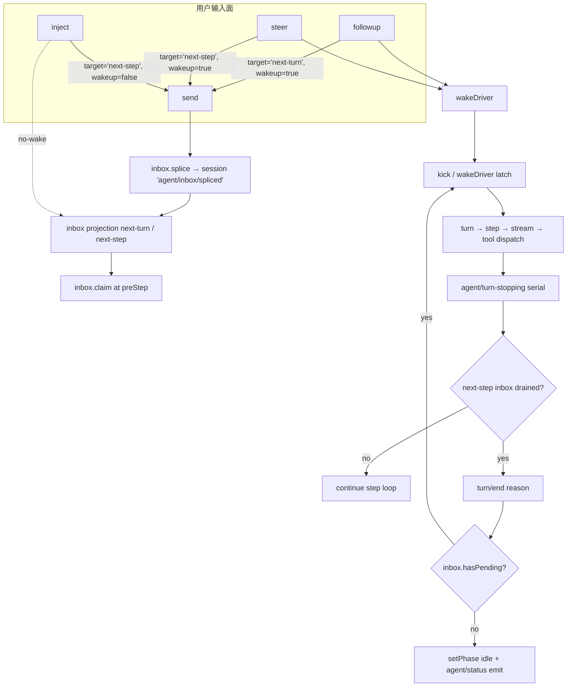

# deepseek-harness REPL / agent loop 执行流程技术文档

> 本文档基于 `deepseek-harness` (DSH) 主仓的 `@deepseek-ai/dsh-agent-loop` / `@deepseek-ai/dsh-agent` / `@deepseek-ai/dsh-session` / `@deepseek-ai/dsh-sdk-server` 等子包,以及 `opencc-web` 仓库 `packages/zn-agent-core/src/compat/subagents/dsh/` 下的 dsh-bridge 桥接层,逐行溯源整理。所有引用一律以 `path:line` 形式给出;代码标识符与文件路径保持英文原文。

## 0. 术语对齐

| 概念 | DSH 端 | opencc-web / dsh-bridge 端 |
|---|---|---|
| 单次 agent 跑动 | `Agent` / `Session` / `ReactLoopAgent` | `task` / `session`(`TranscriptsStore` 用) |
| 用户消息队列 | `Inbox.nextTurn` / `nextStep` | 提交 / 排队 / steer(由 `Agent.followup` / `Agent.steer` / `Agent.inject` 触发) |
| 工具调用 | `tool/call` → `tool/result` (Session 事件) | TaskDrawer SSE 上的 `toolCall` / `toolResult` 事件 |
| Turn 完成事件 | `turn/end` (`data.reason: TurnEndReason`) | `dshChildOutcome` 映射为 `SubagentResult.stopReason` |
| 状态变化 | `agent/status` (`idle` ⇄ `running`) | `session.status = 'idle'` (SDK notification) |
| 事件总线 | Cordis (`ctx.on` / `ctx.emit` / `dispatch('emit')` 等) | `__zaiEventBus` (globalThis) + SSE |
| Wire transport | stdio newline-delimited JSON-RPC 2.0 (SDK server) | `JsonRpcClient` (compat/subprocess/jsonRpc.ts) |

---

## 1. DSH agent loop

### 1.1 主循环定义位置

| 角色 | 文件 | 关键位置 |
|---|---|---|
| 调度容器 / 注册器 | `packages/core/agent/src/index.ts` | `AgentRegistry`(`agent/src/index.ts:250`),`setFactory` (`index.ts:367`)、`create`/`resume` (`index.ts:400-425`) |
| 工厂实现 | `packages/core/agent-loop/src/index.ts` | `AgentLoop extends Service implements AgentFactory`(`agent-loop/src/index.ts:359`);配置 schema `Config`(`agent-loop/src/index.ts:318`) |
| 主循环驱动 | `packages/core/agent-loop/src/agent.ts` | `ReactLoopAgent`(`agent.ts:70`),`kick()`(`agent.ts:222`)、`turn()`(`agent.ts:258`)、`step()`(`agent.ts:344`) |
| 工具调度 | `packages/core/agent-loop/src/tool-calls.ts` | `executeToolCalls(...)`(`tool-calls.ts:60`)、`appendToolCall`(`tool-calls.ts:263`)、`appendToolResult`(`tool-calls.ts:269`) |
| Stream 适配 | `packages/core/agent-loop/src/assistant-stream.ts` | `AssistantStreamAttempt`(`assistant-stream.ts`) |

### 1.2 单 turn 内部的状态机

`ReactLoopAgent.phase`(`agent.ts:39-47`)有三种状态:

```
idle       ──send/followup/steer──▶ running ──turn/end──▶ idle
running    ──runMaintenance──▶ maintenance ──▶ idle
maintenance ──wakeRequested+pending──▶ running
```

- 唤醒(`wakeDriver`)见 `agent.ts:184-205`,从 `idle` 切到 `running` 后调用 `kick()`。
- `kick()`(`agent.ts:222-235`)是 `while (await this.turn()) {}` 主循环;每次 `turn()` 返回 `true` 表示 inbox 还有未消费消息,driver 立即起下一个 turn。
- `turn()`(`agent.ts:258-342`)负责:
  1. `session.append('turn/start', { turn })`(`agent.ts:267`);
  2. 进入 `while (true)` 循环,反复调 `preStep`(`agent.ts:237-255`)声明这一 step;
  3. `session.append('step/start', { turn, step })`(`agent.ts:291`);
  4. 执行 `step()`(`agent.ts:344-482`)即一次完整的 LLM call + tool dispatch + tool result;
  5. `session.append('step/end', { turn, step })`(`agent.ts:304`);
  6. `turn-end` 决策:`agent/turn-stopping`(`agent.ts:308`)是 serial dispatch,通知上层"模型没新回复了"——若上层反对,可 `agent.steer(...)` 触发新 step;
  7. 收尾 `session.append('turn/end', { turn, reason })`(`agent.ts:331`),`reason` 来自 `TurnEndReason` 联合(`{ kind: 'completed' | 'max-tokens' | 'aborted' | 'blocked' | 'error' }`,见 `session/src/types.ts:276`)。

### 1.3 单 step 的微循环

`step(assembly, startsRequestSeries)`(`agent.ts:344-482`)是真正的 model → tool → result 循环:

1. `buildRequest(...)`(`agent.ts:488-588`)组装 frozen `GenerateOptions`:
   - 读取持久化的 `request/header`(`session.requestHeader()`),第一次写 `request/header reason: 'initial'`,变更写 `reason: 'change'`(`agent.ts:551-562`);
   - `provider` / `model` 来自 `AgentOptions`,通过 `agent/request` waterfall(`agent.ts:522`)允许插件替换;
   - 调 `llm.prepareCall(...)`(`agent.ts:533`)绑定 `PreparedLlmCall`;
2. 起 `AssistantStreamAttempt`(`agent.ts:364-371`),它通过 `(frame) => this.dispatch.emit('agent/assistant-stream', { frame })` 把每个 stream chunk 推给 Cordis;
3. `for await (const chunk of stream)`(`agent.ts:378-381`)消费模型流,出错/取消时落 `assistant/attempt` 或带 `interrupted: true` 的 `assistant/message`(`agent.ts:386-422`);
4. 流结束后:
   - `assistant/message`(`agent.ts:458-467`)写入已组装的最终消息;
   - 抽 `toolCalls = message.content.filter(b => b.type === 'tool-call')`(`agent.ts:470`);
   - 没有 tool calls → 返回 `{ kind: 'completed' }` 关闭 step(`agent.ts:471`);
   - 有 tool calls → `executeToolCalls(...)`(`agent.ts:472-475`)并行调度,返回 `{ kind: 'completed' | null }`(`agent.ts:476`)——其中 `null` 表示 step 内部消费了新消息(由 `additionalContexts` 经 `inbox.splice('next-step', ...)` 注入,见 `agent.ts:474`),driver 会再走一轮 step。

### 1.4 Tool dispatch / result

`executeToolCalls(...)`(`tool-calls.ts:60-247`)的主要工作:

- 按 `maxParallelToolCalls`(默认见 `constants.ts`,在 `agent-loop/src/index.ts:190-196` 的 `resolveMaxParallelToolCalls` 生效)分组并发执行;
- 每个 tool 在执行前先 `appendToolCall`(`tool-calls.ts:263`)写出 `tool/call` session 事件(`tool/call` 的 payload:`{ turn, step, callId, name, arguments }`,定义见 `session/src/types.ts:319`);
- 执行完成后 `appendToolResult`(`tool-calls.ts:269-289`)写 `tool/result`(`tool/result` 的 payload 见 `session/src/types.ts:331-337`),用 `surfaceOp: 'append', sourceEventSeqs: [callSeq]` 把它附到 surface 上,这样 message history 的派生会自动把它接到对应 tool call 之后;
- 错误或取消场景:`appendSkippedToolCall`(`tool-calls.ts:250`)为已发出但未执行的 tool 补一条 `Error: tool call aborted before dispatch`。

### 1.5 Loop Mermaid

```mermaid
sequenceDiagram
    autonumber
    participant U as User / Caller
    participant A as ReactLoopAgent
    participant S as Session (event log)
    participant L as llm (LLM Runtime)
    participant T as Tool Provider(s)
    participant C as Cordis Bus (ctx.on/emit)

    U->>A: followup / steer / inject<br/>(send msg → inbox.splice)
    A->>A: wakeDriver() → kick()
    A->>S: append 'turn/start' { turn }
    loop while pre-step yields messages
        A->>A: preStep(): inbox.claim → systemPrompt.assemble
        A->>C: dispatch 'agent/pre-step' (waterfall)
        A->>S: append 'step/start' { turn, step }
        A->>S: append 'user/message'(s)
        A->>L: stream(request) / preparedCall.stream
        L-->>A: chunks (start/chunk/end frames)
        A->>C: emit 'agent/assistant-stream' per frame
        A->>S: append 'assistant/message'(stream, usage)
        alt no tool calls
            A-->>A: stepEnd = { kind: 'completed' }
        else with tool calls
            loop per call (parallel by maxParallelToolCalls)
                A->>S: append 'tool/call' { callId, name, arguments }
                A->>T: invoke tool
                T-->>A: result (content, isError, meta)
                A->>S: append 'tool/result' (sourceEventSeqs:[callSeq])
            end
            opt tool emitted additionalContexts
                A->>A: inbox.splice('next-step', …, [contexts])
            end
        end
        A->>S: append 'step/end' { turn, step }
        A->>C: dispatch 'agent/turn-stopping' (serial)
        opt stopped and inbox drained
            break
        end
    end
    A->>S: append 'turn/end' { turn, reason }
    A->>C: emit 'agent/status' { status: 'idle' }
```

---

## 2. 事件总线 (Cordis) 与事件清单

### 2.1 事件总线机制

DSH 把 Cordis(`@deepseek-ai/cordis`)作为插件框架与事件总线。基础姿势在 `vendor/cordis/src/context.ts:25`(文档注释)说明 `ctx.on` / `ctx.emit` 等 mixin 来源;Cordis 自身有四类派发:

| 派发方式 | 语义 | 内部入口 | DSH 典型用法 |
|---|---|---|---|
| `emit` | 并行广播,首个 sync throw / promise reject 仅警告,不阻断 | `ctx.events.dispatch('emit', [carrier, name, ...payload])` | `agentEvents(...).emit(...)` |
| `serial` | 串行 await,首个 reject 终止链 | `ctx.serial(carrier, name, fusedPayload)` | `agent/turn-stopping` |
| `waterfall` | 围绕式中间件,每个 listener 调 `next()` 沿链向下 | `ctx.waterfall(carrier, name, fusedPayload, next)` | `agent/pre-step`、`agent/request`、`agent/request-error` |
| `parallel` | 并行 await(全跑) | — | (未在 agent-loop 主路径使用) |

`ctx.on(name, listener)` 注册一个监听器,返回 disposer。Agent-subject 事件使用 scoped `this`(通过 `scopeTarget(agent, agent)` 见 `dispatch.ts:94-96`),因此注册到 `agent.ctx` 的 listener **只**接收该 agent 的事件(见 `runtime-types.ts:202-204` 等多处的 `@mode emit` + `Scope-filtered dispatch` 注释)。

### 2.2 融合派发器 `agentEvents`

`ReactLoopAgent` 在构造时就一次性建好 `dispatch = agentEvents(loopCtx, this)`(`agent.ts:97`),后续所有 hot-path 派发零分配:

- 三个方法定义在 `dispatch.ts:54-82`(`AgentEventDispatch` 接口):
  - `emit(name, payload)` — 走 `ctx.events.dispatch('emit', args)`,并把每个 listener 的 sync throw / promise reject 收敛为 `ctx.logger.warn(...)`(`dispatch.ts:120-137`),保证通知不 veto 生命周期;
  - `serial(name, payload)` — `await ctx.serial(carrier, name, fused(payload))`(`dispatch.ts:138-142`);
  - `waterfall(name, payload, ...rest)` — `ctx.waterfall(carrier, name, fused(payload), ...rest)`(`dispatch.ts:143-147`)。
- `fused(payload)`(`dispatch.ts:113-118`)把 `agent` 字段注入;payload 用 `Omit<..., 'agent'>` 收窄(callsite 必须不传 `agent`),spread 在前保证 `agent` 不被覆盖。
- 类型层面 `AgentSubjectEvent`(`dispatch.ts:28-34`)通过 `Events` 联合类型反射,自动从 `Events` 中提取 `this: Scoped<Agent>` + 首参 `{ agent: Agent }` 的事件名集合,防止调用方把非 agent 事件误用此派发器。

### 2.3 Agent-scoped 事件清单

`@deepseek-ai/dsh-agent` 在 `agent/src/runtime-types.ts:191-346` 用 `declare module '@deepseek-ai/cordis'` 扩展 `Events` 接口,完整定义如下:

| 事件名 | 派发模式 | 触发点(file:line) | Payload |
|---|---|---|---|
| `agent/created` | emit | `agent/src/index.ts` 的 `register`/`announce` 流程 | `{ agent: Agent }` |
| `agent/disposed` | emit | `AgentLoop.prepare` 的 dispose 路径(`agent-loop/src/index.ts:606`) | `{ agent: Agent }` |
| `agent/status` | emit | `setPhase(...)`(`agent.ts:116-123`) | `{ agent, status: 'idle' \| 'running' }` |
| `agent/inbox/inserted` | emit | `Inbox.notifications.inserted` 回调(`agent.ts:99` → `inbox.ts:191`) | `{ agent, message }` |
| `agent/inbox/discarded` | emit | 同上 `discarded`(`agent.ts:100` → `inbox.ts:189`) | `{ agent, message }` |
| `agent/inbox/claimed` | emit | 同上 `claimed`(`agent.ts:101` → `inbox.ts:76`) | `{ agent, message, turn }` |
| `agent/session-start` | emit | `AgentLoop.prepare.publish(...)`(`agent-loop/src/index.ts:665` 通过 `emitAgentEvent`) | `{ agent, source: SessionStartSource }` |
| `agent/pre-step` | waterfall | `ReactLoopAgent.preStep`(`agent.ts:246-253`) | `{ agent, messages, turn, step, signal, next }` → `PreStepDecision` |
| `agent/request` | waterfall | `ReactLoopAgent.buildRequest`(`agent.ts:522-525`) | `{ agent, turn, step, signal, next }` → `LlmCallConfig` |
| `agent/request-error` | waterfall | step 出错循环重试处(`agent.ts:432-442`) | `{ agent, turn, step, provider, failure, retryPolicy, signal, next }` → `RequestErrorAction` |
| `agent/assistant-stream` | emit | 每个 stream frame(`agent.ts:370`) | `{ agent, frame: AssistantStreamFrame }` |
| `agent/turn-stopping` | serial | `ReactLoopAgent.turn` 准备关 turn(`agent.ts:308`) | `{ agent, turn, signal }` |
| `agent/error` | emit | `throwError(...)`(`agent.ts:218`) | `{ agent, turn, step, error }` |
| `agent-loop/config-start-failed` | emit | `AgentLoop.reportConfiguredStartupFailure`(`agent-loop/src/index.ts:467`) | `{ sessionId, error }` |

### 2.4 Session 事件清单(Surface 层)

DSH 把每一个模型可见的事实都落盘成 Session 事件。`SessionEventMap`(`session/src/types.ts:260-376`)是 merge-extensible 的事件字典,主流条目:

| 事件类型 | Payload | 关键来源 |
|---|---|---|
| `turn/start` | `{ turn }` | `agent.ts:267` |
| `turn/end` | `{ turn, reason: TurnEndReason }` | `agent.ts:331` |
| `step/start` | `{ turn, step }` | `agent.ts:291` |
| `step/end` | `{ turn, step }` | `agent.ts:304` |
| `user/message` | `UserMessage` | `agent.ts:295` |
| `assistant/message` | `{ turn, step, message, stream, usage?, interrupted? }` | `agent.ts:458-466`、`assistant-stream.ts` |
| `assistant/attempt` | `{ turn, step, stream }` | `agent.ts:411-414`、`427-430` |
| `tool/call` | `{ turn, step, callId, name, arguments }` | `tool-calls.ts:263-266` |
| `tool/result` | `{ turn, step, message, error?, meta? }` | `tool-calls.ts:282-289` |
| `request/header` | `{ header, reason: 'initial' \| 'resume' \| 'change' \| 'series' }` | `agent.ts:552-562` |
| `request/context` | `RequestContext` | `agent.ts:575` |
| `agent/inbox/spliced` | `{ target, start, removedCount?, inserted }` | `inbox.ts:186` |
| `session/end-seed` | `{ inherited? }` | `session` 模块 |

SDK server 在 `sdk/server/src/server.ts:95-127` 订阅三类 Cordis 事件并把它们转成 JSON-RPC notification:

```text
session/event        ──▶  notify('session.event',    { sessionId, event })
agent/status         ──▶  notify('session.status',   { sessionId, status })
session/created (parentSession 不为空) ──▶ notify('subagent.started', { parentSessionId, childSessionId })
subagent/end (local 子会话)         ──▶ notify('subagent.finished', { provider, agentId, parentSessionId, childSessionId, status, stopReason, lastAssistantMessage? })
```

注意:`session.event` 通知包的是 **整张** `SessionEvent`(包括 `turn/start`、`tool/call`、`assistant/message` 等所有 type),所以 dsh-bridge 必须自己做一次 vocabulary 翻译(见 §5)。

---

## 3. 用户消息路径:normal / queue / steer

`ReactLoopAgent` 公开 4 个用户输入 API(都在 `agent.ts`):

| API | file:line | 调用 `inbox.splice` 时的 `target` | wakeup? | 用途 |
|---|---|---|---|---|
| `followup(input)` | `agent.ts:134-136` | `'next-turn'` | `true` | 正常提交:开始下一个 turn |
| `steer(input)` | `agent.ts:138-140` | `'next-step'` | `true` | mid-run 注入:把消息塞到当前 turn 的下一个 step 边界 |
| `inject(input)` | `agent.ts:142-144` | `'next-step'` | `false` | 静默注入:不唤醒 driver,等下次 preStep 自然 claim |
| `send(message, target, wakeup)` | `agent.ts:125-132` | 由 `target` 决定 | 由 `wakeup` 决定 | 通用入口;带 `wakingAfterAbort` 兜底 |

### 3.1 正常提交

`followup` → `send(input, 'next-turn', true)`(`agent.ts:135`)→ `inbox.splice('next-turn', Infinity, 0, [message])`(`agent.ts:130`)→ `wakeDriver()`(`agent.ts:131`)→ 触发 `kick()` → `turn()` → 在 `preStep` 中 `inbox.claim('next-turn', turn)`(`agent.ts:241`)拉走 next-turn 头一条 + next-step 全部 → `session.append('user/message', …)`(`agent.ts:295`)→ 进入 model call。

### 3.2 排队(turn 跑动中再发 followup)

turn 跑动时,如果用户再发 `followup`(或 RPC 端推过来),`send` 会:

1. `this.phase.kind !== 'idle' && this.phase.abort.signal.aborted` 决定要不要把 `target` 改成 `'next-turn'`(`agent.ts:128-129` 的 `wakingAfterAbort`);
2. 走 `inbox.splice('next-turn', …)`,inbox 先写一条 `agent/inbox/spliced` Session 事件(`inbox.ts:186`),再 in-memory 投影;
3. `wakeup=true` → `wakeDriver(wakingAfterAbort)`(`agent.ts:131`):
   - 当前 driver 还活着 → 它会自己 claim 队列(见 `agent.ts:307` 的 `if (turnEnds && this.inbox.nextStep.length === 0) break`),继续正常推进;
   - 当前是 maintenance 或刚 abort 的 running → `phase.wakeRequested = true`(`agent.ts:191`),完成后回 idle 时 `if (wakeRequested && this.inbox.hasPending) this.wakeDriver()`(`agent.ts:232`)自动起新 turn。

排队边界体现在:turn 没结束时 `next-turn` 不会立即触发 step;只有当前 turn `turn-end` 后 `if (!this.inbox.hasPending) return false` 才决定不开新一轮(`agent.ts:336`),否则 `phase.abort = new AbortController(); phase.wakeRequested = false; phase.step = 0; return true`(`agent.ts:337-341`)——驱动会再 `await this.turn()`。

### 3.3 Steer(mid-run 注入)

`steer` → `send(input, 'next-step', true)`(`agent.ts:139`)→ `inbox.splice('next-step', Infinity, 0, [message])` → `wakeDriver()`。

- 若当前 driver 仍 in-flight:`next-step` 队列在每个 step 结束时由 `inbox.claim('next-step', turn)`(`inbox.ts:71-78`)一次性消费;
- `agent/turn-stopping`(`agent.ts:308`)是关键的"反悔点":如果 listener 在 turn-stopping 阶段调用 `agent.steer(...)`,消息会落到 next-step inbox,driver 会把它插入新一轮 step 的 batch 里继续(`agent.ts:307-313` 的 `if (turnEnds && this.inbox.nextStep.length === 0) break` 检查),不会在 turn 已经承诺结束时被丢弃。

### 3.4 静默 inject

`inject` → `send(input, 'next-step', false)`(`agent.ts:143`)。差别只在不唤醒 driver:若当前 idle,消息会留在 inbox 等用户再发 `followup` 或 `steer`;若当前 running,下一 step 会自动 claim。它给"skill 通知"、"subdir AGENTS.md 变更"等场景使用(见 `session/src/types.ts:281-288` 的 `user/message` 注释)。

### 3.5 Mermaid: queue vs steer



---

## 4. Task 完成与终态

### 4.1 Turn / Task 完成信号

**Turn 内**:`turn/end` 是最权威的 turn 边界事件(`agent.ts:331`),`data.reason: TurnEndReason`(`session/src/types.ts:276`)联合类型:

- `kind: 'completed'` — 正常结束(无 tool call 或最后一次 tool call 返回 `concluded`);
- `kind: 'max-tokens'` — 模型撞到 token 上限,被 sticky 保留(`agent.ts:302`:`if (turnEnds === null || turnEnds.kind !== 'max-tokens') turnEnds = stepEnd`);
- `kind: 'aborted'` — 被 `cancel({...})` 中断,`reason` 是 `AgentCancelCause`(`user` / `parent` / `disposed` / `hook`);
- `kind: 'blocked'` — preStep 被 `agent/pre-step` waterfall 拒(`agent.ts:280-281`);
- `kind: 'error'` — 任何未捕获错误,`error` 是 `LlmFailure`(`agent.ts:321-326`)。结构化:`LlmError` 走 `error.failure`,其它走 `{ message: errorChain(error), code: 'UNKNOWN' }`。

**Task/Agent 级别**:
- `agent/status` 在 idle ⇄ running 切换时由 `setPhase` 发出(`agent.ts:121`),消费方用它判断"agent 是否还在跑";
- `agent/disposed` 在 lifecycle 卸载、driver 退出之后、session 注销之前发出(`agent-loop/src/index.ts:606`);
- SDK server 把 `agent/status` 翻译成 `session.status` notification(`sdk/server/src/server.ts:99-101`),最终 wire 名为 `session.status`,值取自 `agent.status`(`'idle'` 或 `'running'`)。这是 dsh-bridge 用来"判断 turn 完成"的关键:`startDshRun` 监听 `session.status === 'idle'`(`run.ts:343-347`)再 settle。

### 4.2 settle 时的 stopReason 映射

`AgentLoop` 的 `whenIdle()`(`agent.ts:207-212`)是 host 同步等待 driver 退出的 hook,但 SDK server 把整段封装在外——它通过 `agent.followup` 触发新 turn,通过 `session.status === 'idle'` 判定 turn 结束,并以最后一次 `turn/end.reason` 作为该 run 的语义结果(`sdk/server/src/server.ts` 全文只调 `followup`,无主动 stop 干预)。

---

## 5. 消息通知与消息注入

### 5.1 模型 → Cordis → SDK Server → Wire

DSH 把所有可见信号都走 session 事件 + Cordis 通知两个并行通道:

1. **durable log**:`session.append(event)`(`session/src/index.ts`,消息派生、replay、checkpoint 全从这里来);
2. **live notification**:`ctx.emit('session/event', session, event)`(`session/src/invariant.ts:222`),SDK server 订阅它并转 `session.event` JSON-RPC 通知(`sdk/server/src/server.ts:95-98`):
   ```ts
   this.disposers.push(ctx.on('session/event', (session, event) => {
     const payload: SessionEventNotification = { sessionId: String(session.id), event }
     this.transport.notify('session.event', payload)
   }))
   ```
3. **辅助 channel**:`agent/status` → `session.status`、`session/created` (parentSession 不空) → `subagent.started`、`subagent/end` (local) → `subagent.finished`(`sdk/server/src/server.ts:99-127`)。
4. **transient stream frames**:`agent/assistant-stream`(`agent.ts:370`)只用于 UI 实时刷流,不进 wire(SDK server 没有订阅它,见 `sdk/server/src/server.ts:128` 的构造函数尾部)。

### 5.2 注入消息的中间介入点

DSH 设计上把"消息注入"分成两个边界:

- **同 agent 内**:`agent.steer(input)` / `agent.inject(input)` / `agent.followup(input)`(`agent.ts:134-144`)直接走 `Inbox.splice`;
- **跨进程 / 跨 SDK**:SDK client 调 `HarnessSession.run(...)`(`sdk/client/src/api.ts:176-224`),它在 `client.prompt(...)` 之后通过 `subscription.next()`(`api.ts:201-213`)收 `session.event` / `session.status`,并在 `status === 'idle'` 时退出循环。

**重要差异**:DSH 内核没有"SDK 端 mid-stream 注入"概念——注入只能走 `agent.followup` / `agent.steer`,即必须经过 `Agent` 这个对象。换言之,如果 wire 上的 client 想在 turn 跑动中加一句话,只能 `client.prompt(sessionId, ...)` 再发一次;server 接到后会 `rec.handle.agent.followup(message)`(`sdk/server/src/server.ts:191`),落入 `inbox.nextTurn`,下一个 turn 自动消费(`api.ts:191`)。这就是 dsh-bridge 在 `request.prompt` 之外不暴露其它 wire 写面的原因(`wire.ts:35-47` 只有 `initialize` / `session/prompt` / `shutdown` 三个 method)。

---

## 6. dsh-bridge 桥接层

> 重要更正:从源码(2026-09)看,opencc-web **没有** `packages/dsh-bridge` 这个独立 workspace。DSH 集成以两种方式存在:
>
> 1. **CLI Subagent provider**:`packages/zn-agent-core/src/compat/subagents/dsh/`(`index.ts` / `run.ts` / `wire.ts` / `config.ts` / `invariant.ts`),通过 `bundle-entry.ts:272` 以 `applyDshProvider` 导出,被 `packages/zai/src/server/services/agentRuntime.ts:535-571` 的 `initAgentRuntime` 在 `subagents.dsh.enabled === true` 时 `applyDsh(registry, dshConfig)` 注册成 "subagent" 轨道;
> 2. **Headless Subagent Runtime**:`createReplSession`(`packages/zn-agent-core/src/compat/repl/createReplSession.ts`)是 opencc vendor 的 print/repl session 抽壳,不是 dsh。
>
> 下面的"dsh-bridge"指 §6.1-§6.4 的 subagent provider;它在工程意义上就是把 dsh SDK runtime 接到 zai 的 `SubagentRegistry`(也是 vendor opencc 的子代理约定)上。

### 6.1 适配器主入口

`packages/zn-agent-core/src/compat/subagents/dsh/index.ts:32-91`:

- `class DshProvider implements SubagentProvider`(`index.ts:32`),关键字段:
  - `name = 'dsh'`;
  - `inheritsParentContext = false` — 子会话**不**继承父对话历史(`index.ts:36`);
  - `capabilities = Object.freeze({ ...NO_START_CAPABILITIES, agentOptions: true })`(`index.ts:37-40`)——只能改 provider/model,其它 host filter 不可改(对齐 dsh `SDK_START_CAPABILITIES`);
  - `agentRouteDefaults = { provider, model }`(`index.ts:47-50`)——给 UI 默认值。
- `apply(registry, config?)`(`index.ts:86-91`):`config === undefined` 或 `config.enabled !== true` 时 `return undefined`,否则 `registry.registerProvider(new DshProvider(resolved))`。

### 6.2 进程拓扑:spawn → handshake → stream → settle

`startDshRun(request, ctx, spec)`(`packages/zn-agent-core/src/compat/subagents/dsh/run.ts:243-282`)是核心编排:

1. `dshSpawnArgv(command, args, spec)`(`run.ts:49-57`)拼出 argv:`[...baseArgs, '--profile', spec.profile]` + `--patch <p>` 列表。`profile: 'sdk'`(`wire.ts:32`)意味着 dsh 进程以 SDK runtime 启动(`sdk/server/src/server.ts:75` 的 `HarnessSdkJsonRpcServer`);
2. `spawnSubprocess({ command, args, cwd, env, signal: request.signal })`(`run.ts:257-267`)—— 子进程 stdio 走 newline-delimited JSON-RPC(`compat/subprocess/jsonRpc.ts` 的 `JsonRpcClient`);
3. `bootstrap(...)`(`run.ts:303-439`)负责完整生命周期:
   - `rpc.onNotification(...)`(`run.ts:322-355`)订阅 `session.event` / `session.status` / `subagent.started` / `subagent.finished`(`wire.ts:42-47` 的 `DSH_SDK_NOTIFICATIONS`);
   - `rpc.request('initialize', { cwd, provider, model, ... })`(`run.ts:358-369`)做握手,校验 `serverInfo.name` / `.version`(`run.ts:370-375`);
   - `rpc.request('session/prompt', { sessionId, contentBlocks: [{ type: 'text', text: request.prompt }] })`(`run.ts:377-392`)发 prompt;server 端 `HarnessSdkJsonRpcServer.prompt(...)`(`sdk/server/src/server.ts:176-193`)转 `agent.followup(message)`;
   - 进入 `while (!settledIdle && !rpc.closed && !internal.cancelled.value)`(`run.ts:395-397`)等待自己 sessionId 的 `session.status === 'idle'` 通知(`run.ts:340-348`);
   - `dshChildOutcome(lastReason)`(`run.ts:64-87`,对齐 dsh `sdkChildOutcome`)把最后一次 `turn/end.reason` 翻成 `SubagentResult.stopReason`:
     ```text
     completed    → completed
     max-tokens   → max-tokens
     aborted+disposed → aborted + diagnostic 'child-disposed'
     blocked      → refusal
     error        → error + diagnostic 'child-error'
     interrupted  → error
     undefined    → error + diagnostic 'missing-terminal'
     ```
   - `teardown(rpc, spec, handle)`(`run.ts:441-461`):bounded best-effort `shutdown` → `rpc.dispose()` → 子进程 kill ladder。

### 6.3 Event vocabulary 翻译:DSH → zai-bg

`projectDshSessionEvent(event: DshSessionEventFrame)`(`run.ts:162-225`)是把 dsh 的 wire frame 翻译成 zai-bg `SubagentEvent` 的关键适配器:

| dsh `session.event.type` | zai-bg `SubagentEvent.type` | 关键映射 |
|---|---|---|
| `assistant/message` | `agentMessage` | 取 `data.message.content[].type==='text'` 拼成 `text`(`run.ts:166-170`、`117-126`) |
| `assistant/chunk` (`data.chunk.type === 'text-delta'`) | `agentMessage`(增量) | `text = chunk.text`(`run.ts:171-177`) |
| `turn/start` | `turnStarted` | 直通(`run.ts:178-179`) |
| `turn/end` | `turnCompleted` | 直通(`run.ts:180-181`) |
| `tool/call` | `toolCall` | `raw = { id: data.callId, name: data.name, input: data.arguments }`(`run.ts:187-199`) |
| `tool/result` | `toolResult` | `raw = { tool_use_id: data.message.content[0].toolCallId }`(`run.ts:204-210`) |
| `commentary` | `commentary`(passthrough) | `run.ts:211-218` |
| 其它(`permission/preset`、`sandbox/mode`、`approval/policy`、`agent/inbox/spliced`、`user/message`、`step/start` …) | `undefined` | drop(`run.ts:219-223`) |

注释里明确写出:若不翻译,TaskDrawer 的 `switch` 找不到任何 case,整条 provider timeline 会从 UI 消失(`run.ts:129-160` 的 design note)。

最终 assistant 文本用 `AssistantTextFold`(`run.ts:96-115`)折叠:优先取最后一次完整 `assistant/message` 的合并文本,否则拼接 `text-delta` chunks,与 stopReason 解耦,让 cancel/error 路径也能保留 partial answer。

### 6.4 opencc vendor 暴露面

vendor(opencc)的 subagent 协议由 `packages/zn-agent-core/src/compat/subagents/registry.ts` 定义,关键 contract:

| 接口 | 来源 | dsh-bridge 落地 |
|---|---|---|
| `SubagentProvider` | `registry.ts` | `DshProvider`(`dsh/index.ts:32-75`) |
| `SubagentRequest` / `SubagentContext` / `SubagentRun` / `SubagentResult` / `SubagentEvent` | `registry.ts` | `startDshRun` 输入输出 + `projectDshSessionEvent` 输出 |
| `SubagentCapabilities` | `registry.ts` 中 `NO_START_CAPABILITIES` + 枚举 | `Object.freeze({ ...NO_START_CAPABILITIES, agentOptions: true })`(`dsh/index.ts:37-40`) |
| `SubagentRegistry.registerProvider(p)` | `registry.ts` | `apply(...)`(`dsh/index.ts:90`) |
| wire (NDJSON JSON-RPC) | `compat/subprocess/jsonRpc.ts` | `JsonRpcClient` 实例(`run.ts:312`) |
| lifecycle adapter | `compat/subagents/cliAgent/runShell.ts` `createCliRunShell` + `toMessage` | `run.ts:269-273` 复用,产出 `run` / `finalizeResult` / `finalizeError` / `internal.pushEvent` 给 UI |

dsh-bridge 不重新实现 vendor 的 `SubagentRegistry`、`createCliRunShell`、`spawnSubprocess`、`JsonRpcClient`,只负责:

- 拼 argv(`dshSpawnArgv` / `run.ts:49-57`);
- 读 zai 设置解析 `DshConfig`(`config.ts` 的 `parseDshConfig` / `safeParseDshConfig`);
- 做 wire handshake + 维护 JSON-RPC client(`run.ts:303-355`);
- 翻译事件 vocabulary(`projectDshSessionEvent`);
- 用 dsh 的 `AssistantTextFold` 等价物(`run.ts:96-115`)折叠 final answer;
- 把 `turn/end.reason` 翻成 vendor `SubagentResult.stopReason`(`dshChildOutcome`)。

---

## 7. DSH 内核 vs dsh-bridge 桥接 vs opencc vendor 暴露面

下面这张表是本文档最重要的统一视角——同一个 agent loop 概念在三层的不同说法:

| 概念 | DSH 内核(`@deepseek-ai/dsh-*`) | dsh-bridge(`packages/zn-agent-core/src/compat/subagents/dsh/`) | opencc vendor 暴露面(`@hotmanxp/opencc` / vendor subagent contract) |
|---|---|---|---|
| Agent 实例 | `ReactLoopAgent`(`agent.ts:70`) | 不直接持有,只通过 `ctx.agents.create` 间接 | `SubagentRun`(`registry.ts`) |
| Session | `Session`(`@deepseek-ai/dsh-session`) | 通过 `sessionId`(string) 引用 | `SubagentRequest.cwd` / `prompt` |
| Driver 唤醒 | `wakeDriver(...)`(`agent.ts:184`) | `client.prompt(sessionId, ...)` 触发 server `agent.followup` | vendor `provider.start(req, ctx)` |
| User input 队列 | `Inbox.nextTurn` / `nextStep`(`inbox.ts:25`) | 在子进程侧由 SDK server 转成 `agent.followup` | vendor 不直接暴露 inbox |
| Steer / inject | `agent.steer` / `agent.inject`(`agent.ts:138-144`) | **不直接对应**;sdk client 没有 steer method,需再发一次 prompt | vendor 不区分 steer / inject |
| 单 turn 推进 | `turn()` / `step()`(`agent.ts:258` / `344`) | server 透明处理 | vendor `SubagentEvent.turnStarted` / `turnCompleted` |
| Tool 调用 | `tool/call` Session 事件 + `executeToolCalls(...)`(`tool-calls.ts:60`) | `projectDshSessionEvent` 翻成 `toolCall`/`toolResult`(`run.ts:187-210`) | vendor `SubagentEvent.toolCall`/`toolResult` |
| Assistant stream | `AssistantStreamAttempt`(`assistant-stream.ts`) + `agent/assistant-stream` emit | server **不**把它送 wire(只送 `assistant/message`),bridge 只见到 `assistant/message` + `assistant/chunk`(后者来自 transient channel) | vendor 无此概念 |
| Tool result meta | `tool/result.data.meta`(JSON,见 `session/src/types.ts:336`) | bridge 直接放行 `data.message` 结构,UI 解析 | vendor `SubagentEvent.toolResult.raw` |
| Stop reason | `TurnEndReason.kind`(`session/src/types.ts:276`) | `dshChildOutcome` → `SubagentResult.stopReason`(`run.ts:64-87`) | `SubagentResult.stopReason: 'completed' \| 'max-tokens' \| 'aborted' \| 'refusal' \| 'error'` |
| 终态通知 | `agent/status`(`agent.ts:121`) → SDK server 翻译 | `session.status === 'idle'`(`run.ts:343-347`) | vendor `SubagentRun.cancelled` / `finalizeResult` |
| 错误诊断 | `LlmError.failure` + `errorChain` | `dshFailureDiagnostic('phase', 'kind')`(`invariant.ts:23`)→ `SubagentResult.diagnostic` | vendor `SubagentResult.errorMessage` + `diagnostic` |
| 插件总线 | Cordis `ctx.on` / `ctx.emit` / `ctx.waterfall` / `ctx.serial`(`vendor/cordis/src/context.ts:25`) | **不直接订阅**;bridge 只走 wire JSON-RPC,不挂载到 host Cordis 上 | vendor 子进程生命周期走 `spawnSubprocess` + `JsonRpcClient` |
| 中间件介入点 | `agent/pre-step` / `agent/request` / `agent/request-error` / `agent/turn-stopping`(waterfall/serial) | **不直接 hook**;只能在 SDK client 层通过发额外 prompt 介入 | vendor `SubagentProvider` 不能 hook 中间件,只能替换/重发 |
| 持久化 | `dsh-session-persistence` SQLite / JSONL,`AgentLoop.restoreOrCreateConfigured`(`agent-loop/src/index.ts:480`) | 子进程侧 dsh 自管,bridge 不持久化 | vendor 由 `TaskStore` 管,`packages/zn-agent-core/src/compat/background/store/` |

---

## 8. 双轨切换与运行时配置

zai 通过 `settings.subagents.dsh`(`packages/zn-agent-core/src/compat/subagents/dsh/config.ts:dshConfigSchema`)开关 dsh 子代理:`enabled: true` 时 `agentRuntime.ts:563-571` 的 `initAgentRuntime` 把 `applyDshProvider` 注入到 `SubagentRegistry`,其它 vendor provider(opencc / opencode)继续共存。完整 schema 见 `dsh/config.ts`:

```text
dshConfigSchema = z.object({
  enabled: z.boolean().optional(),    // 默认 undefined → apply() 不注册
  command: z.string().default('dsh'), // 可执行
  args: z.array(z.string()).default([]),  // 启动前插入,--profile 之前
  profile: z.string().default('sdk'), // dsh --profile sdk
  patches: z.array(z.string()).default([]), // --patch <id> 列表
  dshHome: z.string().optional(),     // DSH_HOME env override
  provider: z.string(),               // initialize 时传给 SDK server
  model: z.string(),
  reasoningEffort: z.string().optional(),
  maxTokens: z.number().int().positive().optional(),
  env: z.record(z.string(), z.string()).optional(), // 子进程 env overlay
  initializeTimeoutMs: z.number().default(...),
  requestTimeoutMs: z.number().optional(),
  shutdownTimeoutMs: z.number().default(...),
  disposeGraceMs: z.number().default(...),
})
```

注:zai 的"主对话" runtime 仍走 `ReplRuntime`(`packages/zai/src/server/services/agentRuntime.repl.ts`,包 `createReplSession` opencc vendor 抽壳)或 `SessionHostRuntimeAdapter`(spawn `opencc -p` 子进程);dsh bridge 只作为 **subagent provider**,承担"把一段子任务交给 dsh SDK runtime 独立执行"的角色。

---

## 9. 关键不变量与陷阱

| 不变量 | 文件:行 | 含义 |
|---|---|---|
| `agent/inbox/spliced` 是 durable 写入 | `agent/src/inbox.ts:186` | inbox 变更先写 Session,再 in-memory 投影;replay 自动还原 |
| `assistant/attempt` 不上 surface | `agent.ts:411-414`、`session/src/types.ts:309-313` | 失败的 attempt 也持久化,但 message history 不派生它 |
| `tool/result` 必须 `sourceEventSeqs:[callSeq]` | `tool-calls.ts:289` | 否则 surface 错位,replay 后 history 不闭合 |
| `agent/pre-step` `next()` 必调 | `agent.ts:248-252` 默认实现;`dispatch.ts:42-82` 类型约束 | 否则中间件链断掉,默认消息永远进不了 step |
| `max-tokens` sticky | `agent.ts:302` | 一旦撞到上限,后续 completed 也不能降级 turn 结果 |
| `turn/end` 必写,即使 block 路径 | `agent.ts:279-282` (`turnEnds = { kind: 'blocked' }; return false`) → `:331` 收尾 | 不能少 turn boundary |
| `wakeAfterAbort` 捕获于 inbox 插入前 | `agent.ts:127-129` | 防止 splice 观察者的 reentrant cancel 重分类 |
| dsh 子进程 launch 默认 `--profile sdk` | `wire.ts:32-39` | 换 profile 会破坏 wire vocabulary |
| bridge 不订 `agent/assistant-stream` | `sdk/server/src/server.ts` 构造函数 | UI 实时流由 SDK server 不暴露,bridge 只能见到 batched `assistant/message` |
| `applyDshProvider` 仅当 `enabled === true` 注册 | `dsh/index.ts:86-91` | 没启用时 `agentRuntime.ts:569-571` 会 warn 提示重建 core |

---

## 10. 速查表:文件路径汇总

| 类别 | 路径 |
|---|---|
| DSH 主循环 | `deepseek-harness/packages/core/agent-loop/src/index.ts`(`AgentLoop`),`agent-loop/src/agent.ts`(`ReactLoopAgent`) |
| DSH Agent 注册器 | `deepseek-harness/packages/core/agent/src/index.ts`(`AgentRegistry`),`agent/src/dispatch.ts`(`agentEvents`) |
| DSH Inbox | `deepseek-harness/packages/core/agent/src/inbox.ts` |
| DSH Agent 事件清单 | `deepseek-harness/packages/core/agent/src/runtime-types.ts:191-346` |
| DSH Session 事件 | `deepseek-harness/packages/core/session/src/types.ts:260-376` |
| DSH Tool 调度 | `deepseek-harness/packages/core/agent-loop/src/tool-calls.ts` |
| DSH SDK server (wire) | `deepseek-harness/packages/sdk/server/src/server.ts:75-297` |
| DSH SDK client (host) | `deepseek-harness/packages/sdk/client/src/api.ts:176-224`(`HarnessSession.run`) |
| dsh-bridge 主入口 | `opencc-web/packages/zn-agent-core/src/compat/subagents/dsh/index.ts` |
| dsh-bridge 运行时 | `opencc-web/packages/zn-agent-core/src/compat/subagents/dsh/run.ts` |
| dsh-bridge wire | `opencc-web/packages/zn-agent-core/src/compat/subagents/dsh/wire.ts` |
| dsh-bridge config | `opencc-web/packages/zn-agent-core/src/compat/subagents/dsh/config.ts` |
| dsh-bridge 错误诊断 | `opencc-web/packages/zn-agent-core/src/compat/subagents/dsh/invariant.ts` |
| zai 主入口注册 | `opencc-web/packages/zai/src/server/services/agentRuntime.ts:513-571` |
| zai ReplRuntime(非 dsh) | `opencc-web/packages/zai/src/server/services/agentRuntime.repl.ts` |
| zai bundle 出口 | `opencc-web/packages/zn-agent-core/src/bundle-entry.ts:267-276` |
| vendor subagent 注册器 | `opencc-web/packages/zn-agent-core/src/compat/subagents/registry.ts` |
| vendor subagent CLI 抽象 | `opencc-web/packages/zn-agent-core/src/compat/subagents/cliAgent/runShell.ts` |
| vendor JSON-RPC client | `opencc-web/packages/zn-agent-core/src/compat/subprocess/jsonRpc.ts` |
| vendor 子进程 spawn | `opencc-web/packages/zn-agent-core/src/compat/subprocess/spawn.ts` |

---

## 文档元信息

- 路径:`/Users/ethan/code/opencc-web/docs/dsh/2026-09-04-deepseek-harness-repl-loop-tech-doc.md`
- 编写日期:2026-09-04
- 覆盖版本:`@deepseek-ai/dsh-*` 仓库 HEAD(rc.8 时代),`opencc-web` Phase 4 收口状态(2026-08-22)
- 调研方法:仅源码静态阅读,未运行任何代码;未修改文件
