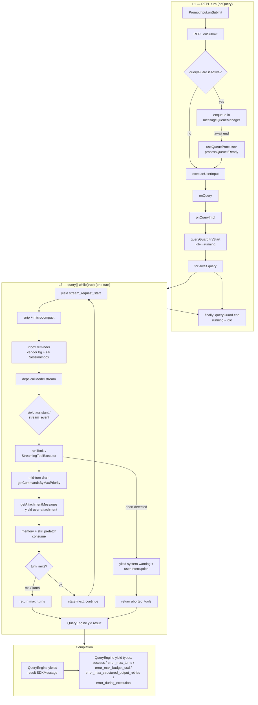

# opencc vendor REPL 执行流程技术文档

> 调研范围:`packages/zn-agent-core/src/opencc-src/`(vendor REPL / `QueryEngine` / `query()` / `messageQueueManager` / `QueryGuard`)。
> 包装层参考:`packages/zn-agent-core/src/`(compat / bundle-entry / sdkEventAdapter)。
> 上层消费:`packages/zai/src/server/routes/agent.ts` 的 `translateRuntimeEvents` 与 `packages/zai/src/server/services/agentRuntime*`。
> 引用风格:`file:line-range`,所有路径相对仓库根 `opencc-web/`。

---

## 0. 总体架构(三层)

```
┌──────────────────────────────────────────────────────────────┐
│  zai 路由层   packages/zai/src/server/routes/agent.ts        │
│   - translateRuntimeEvents(): SDKMessage → RuntimeEvent(SSE) │
│   - queryLoop: for-await runtime events → SSE                │
│   - runtime.query(input) → createOpenccRuntime.query          │
└──────────────────────────────────────────────────────────────┘
                          ▲
                          │ RuntimeEvent(Anthropic primitives)
┌──────────────────────────────────────────────────────────────┐
│  zn-agent-core 包装层  packages/zn-agent-core/src/            │
│   - bundle-entry.ts  esbuild 入口(单 module 实例)             │
│   - compat/runtime/sdkEventAdapter.ts  SDKMessage→Runtime     │
│   - compat/runtime/events.ts  RuntimeEvent 类型契约          │
│   - createOpenccRuntime(QueryEngine + bridge ctx + session)  │
└──────────────────────────────────────────────────────────────┘
                          ▲
                          │ SDKMessage(assistant|user|stream_event|result|system|...)
┌──────────────────────────────────────────────────────────────┐
│  vendor  opencc  src/opencc-src/                              │
│   - screens/REPL.tsx        REPL 顶层 + onQuery               │
│   - utils/handlePromptSubmit.ts  直接提交 / 排队 / 立即命令   │
│   - utils/QueryGuard.ts     状态机: idle/dispatching/running  │
│   - utils/messageQueueManager.ts  module-singleton FIFO        │
│   - query.ts                单 turn 内 while(true) agent loop │
│   - QueryEngine.ts          SDK 多 turn 编排                  │
│   - services/api/claude.ts  deps.callModel = stream loop      │
└──────────────────────────────────────────────────────────────┘
```

zai 与 vendor 之间唯一面向对象是 `RuntimeEvent`(`packages/zn-agent-core/src/compat/runtime/events.ts:39-46`),定义 `eventId / sessionId / ts / turnIndex / type: string` 的判别联合;`runtime.started | runtime.delta | runtime.thinking | runtime.tool_call | runtime.tool_result | runtime.message | runtime.message_thinking | runtime.done | runtime.aborted | runtime.error` 是订阅侧关心的具体子类型。zai 端不直接消费 vendor `SDKMessage`,由 `translateSdkToRuntime`(`packages/zn-agent-core/src/compat/runtime/sdkEventAdapter.ts:74`)翻译。

---

## 1. REPL 主循环(LOOP)

### 1.1 三层循环

vendor REPL 实际由三层循环协作,每一层职责独立:

| 层 | 函数 | 文件:行 | 触发方式 | 终止条件 |
|----|------|---------|---------|----------|
| L1 会话 turn | `REPL → onQuery → onQueryImpl` | `opencc-src/screens/REPL.tsx:3109, 2915` | `queryGuard.tryStart()` 进入 running 态 | `for await` 结束 + finally `queryGuard.end()` |
| L2 单 turn 内部 agent loop | `query()` `while (true)` | `opencc-src/query.ts:628, 2827` | `for await (const event of deps.callModel(...))` 后 `runTools()` | `return { reason: ... }`(completed/aborted/max_turns/hook_stopped/...) |
| L3 LLM 流 | `deps.callModel` | `opencc-src/services/api/claude.ts` | SSE token 推送 | provider stream end / signal abort |

### 1.2 L1:REPL `onQuery` 主流程

入口:用户按 Enter → `PromptInput → onSubmit`(REPL.tsx:3432)→ `handlePromptSubmit`(见 §4)→ `executeUserInput` → `onQuery`(REPL.tsx:3109)。

`onQuery` 流程(`opencc-src/screens/REPL.tsx:3109-3314`):

1. **并发守卫**:`queryGuard.tryStart()`(行 3123)原子转 `idle→running`,返回 generation;若已 running,直接 `enqueue(...)` 并 `return false`(行 3124-3140)。
2. **状态初始化**:`setMessages(old => [...old, ...newMessages])`(行 3152)、`setStreamingText(null)`、`resetCurrentTurn()`、`snapshotOutputTokensForTurn(...)`(行 3151-3158)。
3. **回调链**:`mrOnBeforeQuery(input, latestMessages, newMessages.length)`(行 3167)→ `onBeforeQueryCallback`(行 3171)→ `onQueryImpl(...)`(行 3177)。
4. **核心 `for await`**(`onQueryImpl` 行 3047-3057):
   ```ts
   for await (const event of query({
     messages, systemPrompt, userContext, systemContext,
     canUseTool, toolUseContext, querySource: getQuerySourceForREPL()
   })) {
     onQueryEvent(event);   // → handleMessageFromStream (UI 渲染)
   }
   ```
5. **`finally` 清理**(行 3178-3313):
   - `queryGuard.end(thisGeneration)` 原子 `running→idle`,清 lease、超时、token budget。
   - `mrOnTurnComplete(messagesRef.current, aborted)` 通知 turn 边界。
   - "Auto-restore":若 `abortController.signal.reason === 'user-cancel'` 且无新 prompt 排队,把最后一条 user 消息从 `messagesRef` 撤回(行 3300-3312)。

### 1.3 L2:`query()` 内部 `while (true)` 循环

源码:`opencc-src/query.ts:628-2827`(主循环体)。

每次迭代步骤(行 661 起):

| 步骤 | 范围 | 关键动作 |
|------|------|----------|
| 1. 标记本轮开始 | 行 661 | `yield { type: 'stream_request_start' }`(REPL 端 `case 'stream_request_start':` 跳过) |
| 2. 微 compact / snip | 行 800-828 | `snipCompactIfNeeded` + `microcompact`,压缩 messages 喂给 API |
| 3. 拉取 inbox reminder | 行 707-742 | `buildInboxSystemReminder()`(vendor) + `runExtraReminderProviders(getSessionId())`(zai patch 2026-09-06)→ 拼成 `<system-reminder>` 块 prepend 到 last user message |
| 4. LLM 调用 | 行 1283-1531 | `for await (const message of deps.callModel({...})) { ... yield yieldMessage }` —— 内部 `queryModelWithStreaming`(`services/api/claude.ts`)流式 `assistant` / `stream_event` 消息 |
| 5. 工具执行 | 行 2354-2387 | `streamingToolExecutor.getRemainingResults()`(interleaved 流)或 `runTools(...)`(批量)—— 派发所有 `tool_use` 块 |
| 6. Mid-turn attachment drain | 行 2671-2691 | `getCommandsByMaxPriority(sleepRan ? 'later' : 'next').filter(...)` 把队列里的 prompt / task-notification 转成 attachment user 消息 → **这是 mid-run "steer" 的注入点** |
| 7. Memory/Skill prefetch consume | 行 2700-2729 | 预取的 memory / skill 命中转 attachment |
| 8. 工具失败回路 / agent 步数 limit | 行 2492-2538 | 触发则 `return { reason: 'tool_failure_loop' / 'agent_step_limit' / 'max_turns' }` |
| 9. 终止条件 | 行 2783-2794 | `maxTurns` 超出 → `yield max_turns_reached` + `return` |
| 10. 递归 | 行 2810-2826 | `state = next; continue` 把 messages+assistant+toolResults 拼回去再迭代 |

`while (true)` 退出点(行 2299、2307、2393、2411、2484、2489、2519、2793)对应不同 `reason` 字符串,`return` 后 `query()` generator 关闭,`onQuery` 的 `for await` 结束。

### 1.4 状态机 `QueryGuard`

`opencc-src/utils/QueryGuard.ts`(全文 762 行)三态机:

```
        reserve()                tryStart()              end()/forceEnd()
 idle ─────────────► dispatching ──────────► running ───────────► idle
   ▲                     │                      │
   └── cancelReservation()                      │ (watchdog: idle / hard_max / lease_expired)
                                                  ▼
                                              forceEnd() → idle
```

- `reserve()`(行 184-189):queue 路径,`idle→dispatching`,返回 boolean。
- `tryStart()`(行 217-239):`dispatching→running` 或 `idle→running`(直接提交),返回 generation。
- `end(generation, terminalReason, abortReason)`(行 251-278):CAS 校验 generation 后 `running→idle`,触发 `lifecycleHook`。
- `forceEnd()`(行 290-315):无条件强制,`++_generation` 让旧 finally CAS 失败。
- 监控:`acquireLease / registerActivity / beginUserInteraction`(行 322-432)分别给 API / tool / subagent 续 idle 计时;`hardMax=30min`、`idleTimeout=5min`(行 48-49)。
- `useSyncExternalStore` 接口(行 484-489)被 `REPL` 与 `useQueueProcessor` 订阅,触发 `isQueryActive` 重渲染。

---

## 2. 事件池(Event Pool)

### 2.1 vendor `query()` yield 的事件类型

`opencc-src/query.ts` 内 `yield` 的全部事件形态(由 zai adapter / QueryEngine / REPL `handleMessageFromStream` 共同消费):

| 事件 `type` | 产生点(file:line) | 载荷 | 流向 |
|------------|--------------------|------|------|
| `stream_request_start` | `query.ts:661` | `{}` | REPL `onQueryEvent` switch case 显式 skip(REPL.tsx:1018) |
| `stream_event` | `deps.callModel` 流内(`services/api/claude.ts`) | `event: <raw Anthropic SSE event>`(message_start / content_block_* / message_delta / message_stop) | adapter 解包;QueryEngine 内部 `case 'stream_event'` 更新 usage、转发给 SDK |
| `assistant` | `query.ts:1494`(`assistantMessages.push` 后随上下文 yield) | `Message` 含 `message.content: ContentBlock[]`(text/thinking/tool_use) | REPL 渲染 + QueryEngine 推到 mutableMessages |
| `user` | `query.ts:908`(case 'user' / tool_result user 消息) | 工具结果 / mid-turn 注入的 attachment user 消息 | REPL 渲染 |
| `progress` | `stopHooks` / `runTools` | 工具进度/状态 progress 消息 | QueryEngine 透传(行 895-907) |
| `attachment` | `query.ts:2681, 2705, 2722` | `{ type: 'queued_command' \| 'max_turns_reached' \| 'structured_output' \| ... }` | QueryEngine `case 'attachment'` 处理 max_turns_reached(行 966-998)等 |
| `system` | 多处 | `subtype: 'compact_boundary' \| 'api_error' \| 'microcompact_boundary' \| 'snip_boundary' \| 'local_command' \| ...` | QueryEngine `case 'system'`(行 1021-1098) |
| `tool_use_summary` | `services/toolUseSummary` + `query.ts:1101` | `{ summary, preceding_tool_use_ids }` | REPL 渲染 mobile UI 摘要 |
| `tombstone` | `query.ts:1354` 流式 fallback 时清空已 yield 的部分 | `{ message: AssistantMessage }` | 消费方删 transcript + UI |
| `result` | `QueryEngine.ts:719, 976, 1121, 1165, 1224, 1276` | `{ subtype: 'success' \| 'error_max_turns' \| 'error_max_budget_usd' \| 'error_max_structured_output_retries' \| 'error_during_execution', duration_ms, num_turns, total_cost_usd, usage, modelUsage, permission_denials, fast_mode_state, structured_output? }` | zai SDK / gRPC 端点收到 → adapter 拼成 `runtime.done` |
| `system_init` | `QueryEngine.ts:642`(SDK 路径) | 工具/MCP/模型/权限模式/skills/plugins 清单 | SDK 消费,REPL 路径不产生 |

### 2.2 REPL 端 `handleMessageFromStream` 消费

REPL 把 `query()` 产物折到 `onQueryEvent`(REPL.tsx:2837)=> `handleMessageFromStream`(utils/messages.js),主关注:

- `assistant` → `setMessages(prev => [...prev, message])`,更新 `streamingText` / `streamingThinking` / `streamingToolUses`。
- `stream_event message_start` → 启动新 assistant 消息槽。
- `stream_event content_block_delta(text)` → 增量更新 `streamingText`。
- `stream_event message_stop` → 收尾(REPL 端不上报 stop_reason,只关流)。
- `user`(tool_result)→ 推 messages,清 streaming state。
- `attachment` → system 通知 / progress / 渲染 toolbar。
- `system` 视 `subtype` 分流;`compact_boundary` → `getMessagesAfterCompactBoundary` 截断。
- `tool_use_summary` → mobile 卡片预览。

### 2.3 zai RuntimeEvent 类型(zai 边界)

`packages/zn-agent-core/src/compat/runtime/sdkEventAdapter.ts` 把 `SDKMessage` 翻成 zai `RuntimeEvent`,主要产出:

| `type` | 含义 | 出处 |
|--------|------|------|
| `runtime.started` | 新 assistant 消息槽已开 | `routes/agent.ts:387`(同步 turnIndex) |
| `runtime.thinking` | thinking block delta | `routes/agent.ts:531` |
| `runtime.delta` | text block delta | `routes/agent.ts:431, 438` |
| `runtime.tool_call` | tool_use 块定型 | `routes/agent.ts:501, 512, 539, 548` |
| `runtime.tool_result` | tool_result 消息 | `routes/agent.ts:1519`(zai 收 result 时) |
| `runtime.message` / `runtime.message_thinking` | 终端 assistant 消息(用于没有 stream_event 的 fallback) | `routes/agent.ts` |
| `runtime.done` | turn 结束,带 total/duration/modelUsage/permission_denials | `routes/agent.ts:718, 730, 814, 835` |
| `runtime.aborted` | 外部中断(ESC / `interrupt` 等) | `routes/agent.ts:760`(error/aborted 统一处理) |
| `runtime.error` | `error_during_execution` / `error_max_turns` / `error_max_budget_usd` / `error_max_structured_output_retries` | `routes/agent.ts:662, 742, 801, 1083, 1751` |

---

## 3. 用户 prompt 路径

### 3.1 直接提交(turn-by-turn)

链路:`PromptInput.onSubmit` → `REPL.onSubmit`(REPL.tsx:3432)→ `handlePromptSubmit`(utils/handlePromptSubmit.ts:127)→ `executeUserInput`(行 404)→ `onQuery` → `onQueryImpl` → `query()` / `QueryEngine.submitMessage`。

`executeUserInput`(行 404-633)核心步骤:

1. `createAbortController()` + `setAbortController(...)`(行 427-428)。
2. `queryGuard.reserve()` 提前占位(行 446),让并发 `handlePromptSubmit` 看到 `isActive===true` 走排队路径。
3. `processUserInput(...)`(行 485)对 prompt 做命令分流(bash / slash / 文本 + 附件 + IDE selection)。
4. `onQuery(newMessages, abortController, shouldQuery, allowedTools, mainLoopModel, onBeforeQuery, input, effort)`(行 577)。
5. `finally` 释放 `queryGuard.cancelReservation()`(行 623)+ 清 placeholder(行 631)。

`QueryEngine.submitMessage`(QueryEngine.ts:225)对 SDK 端额外做的事:

- `processUserInput` → `shouldQuery === true` 路径:把消息推进 `mutableMessages`,写 transcript(行 535-548),yield `buildSystemInitMessage`(行 642)。
- `for await (const message of runQuery({...}))` 收 SDKMessage,按 `case 'assistant' | 'user' | 'stream_event' | 'attachment' | 'system' | 'tool_use_summary' | 'progress' | 'tombstone'` 分流(行 776-1109)。
- 终止:`result` SDKMessage yield 后函数结束(行 1199-1296)。

### 3.2 队列(Prompt Queueing)

#### 3.2.1 单一 module-singleton 队列

`opencc-src/utils/messageQueueManager.ts`(全文 559 行)是**进程级 FIFO**(`commandQueue: QueuedCommand[]` 行 52),React 组件通过 `useSyncExternalStore(subscribeToCommandQueue, getCommandQueueSnapshot)` 订阅;非 React 代码直接 `getCommandQueue()` / `getCommandQueueLength()`。

优先级(行 161-165):
```
now(0) > next(1) > later(2)
```

- `enqueue(cmd)`(行 127-140):默认 `priority: 'next'`,UI 输入;
- `enqueuePendingNotification(cmd)`(行 147-159):默认 `priority: 'later'`,后台任务完成通知;
- `dequeue(filter?)`(行 177-203):优先返回高优先级 cmd,同优先级 FIFO;
- `peek(filter?)`(行 229-248):非破坏读;
- `popAllEditable(currentInput, cursorOffset)`(行 439-495):把队列中 editable cmd 拼到当前 input(↑ 快捷)。

#### 3.2.2 中转路径:在 turn in-flight 期间

`handlePromptSubmit` 在 `queryGuard.isActive` 时走排队(utils/handlePromptSubmit.ts:320-359):

```ts
if (queryGuard.isActive || isExternalLoading) {
  if (mode !== 'prompt' && mode !== 'bash') return;     // 其它 mode 丢弃
  if (mode !== 'prompt' && params.hasInterruptibleToolInProgress) {
    params.abortController?.abort('interrupt');         // 显式中断 opt-in
  }
  enqueue({ value: finalInput.trim(), preExpansionValue: input.trim(),
           mode, pastedContents: hasImages ? pastedContents : undefined,
           skipSlashCommands, uuid });
  onInputChange('');  setCursorOffset(0);  setPastedContents({});
  resetHistory();  clearBuffer();
  return;
}
```

> 注意:`hasInterruptibleToolInProgress`(REPL.tsx:3883)与 `queryGuard.isActive` 是两个独立开关;`hasInterruptibleToolInProgress` 表示"当前 turn 跑到可被 mid-run 注入的阶段",但 vendor 实际是 `isActive + 中转 drain`,见 §3.3。

#### 3.2.3 队列消费

`opencc-src/hooks/useQueueProcessor.ts:28`(被 REPL.tsx:4242 调用)通过 `useSyncExternalStore(queryGuard.subscribe, ...)` 监听 guard 状态 + `subscribeToCommandQueue` 监听队列变化。当 `!isQueryActive && !hasActiveLocalJsxUI && queueSnapshot.length > 0` 时调用 `processQueueIfReady({ executeInput: executeQueuedInput })`。

`opencc-src/utils/queueProcessor.ts:52-87` 决定一次取多少:
- 若队首是 `/` 开头的 slash 命令或 `mode === 'bash'` → 一次只取 1 条,逐条走 `executeInput`(per-command 错误隔离)。
- 否则 `dequeueAllMatching(cmd => !isSlashCommand && cmd.mode === targetMode)` 一次取同 mode 的所有非 slash 项,塞给 `executeInput([...])`(每个 cmd 自带 UUID,变成多条 user message)。

`executeQueuedInput`(REPL.tsx:4187-4241)把多条 cmd 拍平后调 `handlePromptSubmit({ queuedCommands: [...], ... })`,走 `executeUserInput` 的批量 for 循环(`handlePromptSubmit.ts:482-538`)。

### 3.3 Mid-run 注入(Steer)

#### 3.3.1 turn-internal drain(同 turn 注入)

**关键路径**:`opencc-src/query.ts:2671-2744`(`getCommandsByMaxPriority` → `getAttachmentMessages` → `removeFromQueue`)。

每次 `while (true)` 迭代在工具执行后(行 2354-2387 之后)做:

```ts
const sleepRan = toolUseBlocks.some(b => b.name === SLEEP_TOOL_NAME);
const isMainThread =
  querySource.startsWith('repl_main_thread') ||
  querySource === 'server-repl' ||
  querySource === 'sdk';
const queuedCommandsSnapshot = getCommandsByMaxPriority(
  sleepRan ? 'later' : 'next',
).filter(cmd => {
  if (isSlashCommand(cmd)) return false;
  if (isMainThread) return cmd.agentId === undefined;
  return cmd.mode === 'task-notification' && cmd.agentId === currentAgentId;
});
for await (const attachment of getAttachmentMessages(null, updatedToolUseContext,
    null, queuedCommandsSnapshot, [...messagesForQuery, ...assistantMessages, ...toolResults],
    querySource)) {
  yield attachment;
  toolResults.push(attachment);
}
// ...
const consumedCommands = queuedCommandsSnapshot.filter(
  cmd => cmd.mode === 'prompt' || cmd.mode === 'task-notification',
);
if (consumedCommands.length > 0) {
  for (const cmd of consumedCommands) {
    if (cmd.uuid) {
      consumedCommandUuids.push(cmd.uuid);
      notifyCommandLifecycle(cmd.uuid, 'started');
    }
  }
  removeFromQueue(consumedCommands);
}
```

特点:

- **同 turn 内已被模型感知**:被 drain 的 prompt 变成 user-attachment 消息,`toolResults` 拼进下一轮 `messagesForQuery`(`query.ts:2811`),下一轮 `deps.callModel` 就会看到;**不打断当前 turn,不需要 abort**。
- `sleepRan === true` 时降级到 `'later'`(只在 SleepTool 工具末尾统一消费,保证 Sleep 中途无干扰)。
- Slash 命令**不**走 mid-turn drain,统一走 turn 之间的 `useQueueProcessor` → `processSlashCommand`。
- 主线程 filter `cmd.agentId === undefined`;子 agent 只能消费 `mode === 'task-notification' && cmd.agentId === currentAgentId` 的子 agent 通知(避免主线程 prompt 串到子 agent)。
- 消费成功的 cmd 通过 `consumedCommandUuids` + `notifyCommandLifecycle(uuid, 'started')` 上报生命周期事件(`utils/commandLifecycle.ts`)。

#### 3.3.2 Steer(显式中断式注入)

通过 `handlePromptSubmit` 的 `mode !== 'prompt' && hasInterruptibleToolInProgress` 分支(`utils/handlePromptSubmit.ts:329-340`):

```ts
if (mode !== 'prompt' && params.hasInterruptibleToolInProgress) {
  logForDebugging(`[interrupt] Aborting current turn: streamMode=${params.streamMode}`);
  logEvent('tengu_cancel', { source: 'interrupt_on_submit', streamMode: params.streamMode });
  params.abortController?.abort('interrupt');
}
// 然后继续 enqueue(同 3.2.2)
```

`abort('interrupt')` 让当前 turn 在 `query.ts:2450` 检测到 `abortController.signal.aborted` 后 yield `getQueryAbortSystemMessage(reason)` + `createUserInterruptionMessage({ toolUse: true })`(`query.ts:2465-2474`)+ `return { reason: 'aborted_tools' }`。turn 结束后 `useQueueProcessor` 重新触发 `processQueueIfReady` → 队列里被 `enqueue` 的 cmd 走下一 turn。

REPL 端 Esc 触发的 "cancel + restore" 走另一条路:`onCancel`(REPL.tsx:2315-2370)`abortController?.abort('user-cancel')` + `setAbortController(null)` + 触发 `mrOnTurnComplete(messagesRef.current, true)`;若 `signal.reason === 'user-cancel'` + `!queryGuard.isActive` + `inputValueRef.current === ''` 则回滚最后一条 user 消息(行 3300-3312),把打字框恢复到 prompt 提交前。

### 3.4 Prompt 路径时序图

```mermaid
sequenceDiagram
    autonumber
    actor U as User
    participant PI as PromptInput
    participant OS as REPL.onSubmit
    participant HP as handlePromptSubmit
    participant EU as executeUserInput
    participant QG as QueryGuard
    participant MQ as messageQueueManager
    participant QP as useQueueProcessor
    participant OQ as onQuery (REPL)
    participant QE as QueryEngine.submitMessage
    participant Q as query() while(true)
    participant ES as escape(Esc)

    U->>PI: input + Enter
    PI->>OS: onSubmit(input, helpers)
    OS->>HP: handlePromptSubmit({input, ...})
    HP->>QG: read isActive
    alt guard.isActive
        HP->>MQ: enqueue({value, mode, ...})
        HP-->>OS: return; clear input
        Note over HP,MQ: 等待当前 turn 结束
        OQ-->>QG: end() running→idle
        MQ-->>QP: snapshot change notify
        QP->>HP: processQueueIfReady → executeQueuedInput
        HP->>EU: queuedCommands=[cmd]
        EU->>QG: reserve() idle→dispatching
        EU->>OQ: onQuery(newMessages, ...)
    else guard idle
        HP->>EU: executeUserInput(queuedCommands=[cmd])
        EU->>QG: reserve() idle→dispatching
        EU->>OQ: onQuery(newMessages, ...)
    end
    OQ->>QG: tryStart() dispatching→running
    OQ->>QE: engine.submitMessage(prompt)
    QE->>Q: runQuery({...})
    loop while(true) [每个 turn]
        Q->>Q: deps.callModel(stream)
        Q-->>QE: yield assistant / stream_event
        Q->>Q: runTools(toolUseBlocks)
        Q->>MQ: getCommandsByMaxPriority('next')
        MQ-->>Q: queuedCommandsSnapshot
        Q->>Q: getAttachmentMessages → mid-turn inject
        Q-->>QE: yield attachment(user)
        Q->>Q: state = next; continue
    end
    Q-->>QE: return {reason: 'completed' | ...}
    QE-->>OQ: yield result SDKMessage
    OQ->>QG: end() running→idle
    OQ-->>PI: mrOnTurnComplete
    Note over PI,OQ: 进入下一 turn 起点
    U->>ES: Esc mid-turn
    ES->>OQ: abortController.abort('user-cancel')
    OQ->>QG: forceEnd() running→idle
    OQ-->>PI: restore last user message
```

---

## 4. 任务完成(Task Completion)

### 4.1 turn 终止信号

- `result` SDKMessage(QueryEngine.ts:719, 976, 1121, 1165, 1224, 1276):
  - `subtype: 'success'`:正常结束(行 1276-1296)。`is_error = isApiErrorMessage`;`result` 字段取最后一个 `text` 块(过滤 `SYNTHETIC_MESSAGES`,行 1262-1274)。
  - `subtype: 'error_max_turns'`:超过 `maxTurns`(行 975-997)。
  - `subtype: 'error_max_budget_usd'`:超过 `maxBudgetUsd`(行 1121-1141)。
  - `subtype: 'error_max_structured_output_retries'`:JSON schema 校验失败超过 `MAX_STRUCTURED_OUTPUT_RETRIES`(行 1165-1188)。
  - `subtype: 'error_during_execution'`:`!isResultSuccessful(result, lastStopReason)`(行 1223-1259),`errors` 携带 `ede_diagnostic` + turn 内 in-memory error log(以 `errorLogWatermark` 为基准,行 770, 1247-1256)。
- `query.ts` `while (true)` 返回:
  - `return { reason: 'completed' }`(行 2299)
  - `return { reason: 'aborted_tools' }`(行 2484,被 `abortController.abort()`)
  - `return { reason: 'hook_stopped' }`(行 2489,Stop hook 阻断)
  - `return { reason: 'tool_failure_loop' }`(行 2519)
  - `return { reason: 'max_turns' }`(行 2793)
  - `return { reason: 'agent_step_limit' }`(行 2291, 2408)
  - `return { reason: 'blocking_limit' }`(行 1233,token 阈值过载 + 重试冷却)

### 4.2 `stop_reason` 捕获

`lastStopReason` 在 `QueryEngine.ts:765, 889, 930, 982, 1128, 1171, 1231, 1284` 维护,通过 `stream_event message_delta.delta.stop_reason` 提取(行 930);`assistant.message.stop_reason` 在 `content_block_stop` 时尚为 null,必须等 `message_delta`。这把 vendor 的真实 stop_reason(`end_turn` / `tool_use` / `max_tokens` / `stop_sequence` / `refusal`)如实反映到 result SDKMessage。

### 4.3 turn 边界事件

- REPL `onQuery.finally`(REPL.tsx:3178-3313):
  - `queryGuard.end(thisGeneration)`:成功则 `sendBridgeResultRef.current()`(行 3194,通知 CCR/mobile 端 turn 完成)、`resetLoadingState()`(行 3189)、`setAbortController(null)`(行 3283)。
  - `mrOnTurnComplete(messagesRef.current, aborted)`(行 3190):父组件 prop,React 端 turn 收尾。
  - `setMessages(turnDurationMessage)`:>30s 或带 token budget 的 turn 加耗时消息(行 3232-3245)。
  - `setMessages(cacheStatsLine)`:`showCacheStats !== 'off'` 时打印(行 3253-3271)。
- `useQueueProcessor` 在 `queryGuard` 转 idle 时被 `useEffect` 触发,自动消费下一个排队 prompt(REPL.tsx:4242)。

### 4.4 abort / interrupt 信号

- `onCancel`(REPL.tsx:2315-2370)→ `abortController?.abort('user-cancel')`(行 2354, 2359)→ `setAbortController(null)`(行 2366)。
- `onQuery` 内 `params.abortController?.abort('interrupt')`(handlePromptSubmit.ts:339)用于 steer 路径。
- `runtime.abort(sessionId, reason)` 精确 abort 某 session(`createOpenccRuntime-impl.ts:813-825`)。

`AbortController` 是单次用品,`QueryEngine.replaceAbortController()`(QueryEngine.ts:1320)被 `runtime.query`(createOpenccRuntime-impl.ts:690)在每次 query 时调用,避免 ESC 后第二次 submit 落入 `signal.aborted===true` 短路。

---

## 5. 消息通知与注入(Message Notification & Injection)

### 5.1 消息类型全景

vendor `Message` 类型(`opencc-src/types/message.ts:81-120`)`type` 联合:

```
'user' | 'assistant' | 'system' | 'function' | 'placeholder' |
'attachment' | 'progress' | 'tombstone' | 'request_start' |
'stream_event' | 'tool_summary' | 'hook_result' |
'system_local_command' | 'text' | 'summary' | 'result'
```

子类型细分:

- `user.message.content`:string 或 `ContentBlock[]`(text/image/tool_result)。
- `user.isMeta`:合成消息,UI 隐藏但喂给模型。
- `user.toolUseResult`:工具结果,跳过 transcript ack。
- `user.origin`(zai patch 2026-09-01):`MessageOrigin.kind` ∈ `human | coordinator | channel | task-notification | server`,渲染时按 `taskKind / enqueuedAt` 分流文案(`utils/messages.ts` queued_command 分支)。
- `user.message.role: 'user' | 'assistant'`(tool_result 是 'user')。
- `system.subtype`:`'init' | 'compact_boundary' | 'api_error' | 'microcompact_boundary' | 'snip_boundary' | 'local_command' | 'warning' | ...`。

### 5.2 通知与注入入口

| 注入源 | 路径 | 用途 |
|--------|------|------|
| 主 UI 输入 | `enqueue({value, mode: 'prompt'})` → mid-turn drain / queue processor | 用户文本 |
| 后台 bash 完成 | `enqueuePendingNotification({mode: 'task-notification', taskKind: 'bash'})` | 等待 `priority: 'later'` |
| 子 agent 完成 | `enqueuePendingNotification({mode: 'task-notification', taskKind: 'agent', agentId})` | 子 agent 单点回灌 |
| Workflow 完成 | 同上,`taskKind: 'workflow'` | |
| Monitor tool | `taskKind: 'monitor'`,`priority: 'next'`(MONITOR_TOOL 开启时) | 即时回灌 |
| Proactive tick | `enqueue({value, mode: 'prompt', workload: 'proactive'})` | 周期性 system reminder |
| Scheduled task | `enqueue({value, mode: 'prompt', workload: 'scheduled'})` | 定时任务 |
| 跨 session 通道消息 | `enqueue({mode: 'channel', origin: {kind: 'channel'}})` | 跨进程通道 |
| 桥接(CCR / mobile) | `bridgeOrigin` 字段标注 | WebSocket / 远端 |

> 同一 module-singleton 队列进程级共享(`messageQueueManager.ts:52-60`)。zai 的 `runtime.query(input)`(`createOpenccRuntime-impl.ts:583`)每次新建一个 `queryAbortController` 但不重置队列;`agents: [...].in-process` 子 agent 自己消费自己 `agentId` 的项(见 §3.3.1 filter)。

### 5.3 Interrupt / Status / Tool Progress / System Notice 注入位置

- **Interrupt**:`abortController.abort('user-cancel' | 'interrupt' | 'background')` → `query.ts:2450-2484` 检测 signal,`yield createSystemMessage(getQueryAbortSystemMessage(reason), 'warning')` + `yield createUserInterruptionMessage({toolUse: true})`。
- **Status**:`addNotification({key, jsx, priority, timeoutMs?})`(REPL.tsx:811, `useNotifications`)用于通知中心;底层是 `services/notifications/`。
- **Tool Progress**:`progress` 消息(`query.ts:895-907` QueryEngine `case 'progress'`)+ `tool_use_summary` 消息(`query.ts:1101`)+ `streamingToolUses` 状态(REPL.tsx:943)。
- **System Notice**:`system` 消息(任意 subtype)由 `case 'system'`(QueryEngine.ts:1021-1098)处理:`compact_boundary` 截断 + yield SDK;`api_error` 转 `api_retry` SDK;`local_command` 转 `localCommandOutputToSDKAssistantMessage`;其它 subtype 在 SDK 路径不外发,REPL 路径通过 `handleMessageFromStream` 渲染(本地命令 stdout / stderr tag 在 messages.ts 转)。

### 5.4 mid-stream 注入(具体场景)

| 场景 | 注入点 | 表现 |
|------|--------|------|
| 用户在 turn 中追加 prompt | `query.ts:2671-2691` mid-turn drain | 变成 user-attachment,模型下一轮看到 |
| 后台 bash 任务完成 | `enqueuePendingNotification` → `query.ts:2671` drain(若 `!sleepRan` 取 `priority: 'next'`,否则降 `'later'`) | turn 末或 Sleep 后注入 |
| 子 agent 通知 | 同上,带 `agentId` filter | 子 agent 完成时回灌主 thread |
| Steer 显式中断式注入 | `handlePromptSubmit.ts:329-340` + `abort('interrupt')` | 当前 turn 中止,排队 cmd 下一 turn 执行 |
| 取消并重打 | `onCancel` → `restoreMessageSyncRef` | 恢复最后 user 消息到 input |
| ↑ 队列上调 | `popAllEditable` → 拼到 input | 集中编辑 |

---

## 6. Tool Calling 简述

### 6.1 发现与执行

1. **assistant 消息中 `tool_use` 块**:`query.ts:1494-1531` 在 `deps.callModel` 流内累积 `toolUseBlocks`(行 1501)与 `needsFollowUp`(行 1502)。`streamingToolExecutor.addTool(toolBlock, message)`(行 1510)把块入流式执行器。
2. **Streaming execution**:`StreamingToolExecutor`(services/tools/StreamingToolExecutor.ts)在前几个 tool_use 完成时立即 `yield` 结果,实现流式并行(行 1519-1530)。zai 的 translateRuntimeEvents 配合 `toolNameByUseId` 把工具名挂在 tool_result 上,产出 `runtime.tool_call` + `runtime.tool_result` 对。
3. **Batch execution**:`runTools(toolUseBlocks, assistantMessages, canUseTool, toolUseContext)`(`services/tools/toolOrchestration.ts`,query.ts:2356)在流执行器未启用时批量串行执行。
4. **Permission gate**:`canUseTool`(`hooks/useCanUseTool.ts`)是 LLM 调用工具前必经钩子,REPL 端通过 `useCanUseTool(setToolUseConfirmQueue, setToolPermissionContext)`(REPL.tsx:2589)接线,触发 permission 弹窗(在 `getFocusedInputDialog` 优先级:line 2238 `'tool-permission'`)。

### 6.2 结果回流

`tool_result` 块作为新 user 消息 `toolResults.push(...)`(query.ts:2374-2379)→ 进入下一轮 `messagesForQuery`(`query.ts:2811`)→ `deps.callModel` 再发,模型继续推理。

### 6.3 工具列表刷新

`refreshTools`(`QueryEngine.ts:154, 433, 598, 2611, 2762`):

- QueryEngine 在 `submitMessage` 入口调用 `config.refreshTools()`(行 293-295),让 MCP 工具 turn-1 即生效。
- query.ts 每轮工具执行后 `updatedToolUseContext.options.refreshTools()`(行 2761-2772),"between turns" 增量合并。
- zai 端 `getToolUseContext.computeTools()`(REPL.tsx:2611-2617)实时合并 `appState.mcp.tools`。

### 6.4 Tool 失败回路保护

`query/toolFailureLoopGuard.ts`:同签名/同类目/同路径工具连续失败触发 `toolFailureLoopDecision.tripped`(query.ts:2497-2520)→ `yield createAssistantAPIErrorMessage` + `return { reason: 'tool_failure_loop' }`。

---

## 7. vendor 源码 vs zn-agent-core 包装层暴露面

### 7.1 vendor 内部实现(vendor 私货,不直接 export)

这些符号是 vendor 自身协作使用,**zn-agent-core 包装层不会全部 re-export**,zai 端也不会直接 import;它们的价值在于:理解 REPL / query / QueryEngine 之间如何协作。

| 符号 | 文件:行 | 角色 |
|------|---------|------|
| `REPL` 组件 | `opencc-src/screens/REPL.tsx:615` | TUI(Ink) 顶层,直接消费 `query()` |
| `onQuery` / `onQueryImpl` | `opencc-src/screens/REPL.tsx:3109, 2915` | turn 入口,经 `queryGuard` / `handleMessageFromStream` |
| `onSubmit` | `opencc-src/screens/REPL.tsx:3432` | 文本框 Enter 入口 |
| `onCancel` | `opencc-src/screens/REPL.tsx:2315` | Esc 入口 |
| `handlePromptSubmit` | `opencc-src/utils/handlePromptSubmit.ts:127` | prompt 处理 + 立即命令 / 队列路由 |
| `executeUserInput` | `opencc-src/utils/handlePromptSubmit.ts:404` | reserve + processUserInput + onQuery 编排 |
| `processUserInput` | `opencc-src/utils/processUserInput/processUserInput.ts` | 命令/附件/IDE selection 处理 |
| `useQueueProcessor` | `opencc-src/hooks/useQueueProcessor.ts:28` | useSyncExternalStore + processQueueIfReady |
| `processQueueIfReady` | `opencc-src/utils/queueProcessor.ts:52` | 批量/单条决定 |
| `QueryGuard` | `opencc-src/utils/QueryGuard.ts:143` | idle/dispatching/running 状态机 |
| `messageQueueManager` | `opencc-src/utils/messageQueueManager.ts:52-559` | module-singleton 队列 + useSyncExternalStore |
| `query()` | `opencc-src/query.ts` 主体 | 共享的 agent loop(REPL + SDK 共用) |
| `QueryEngine` | `opencc-src/QueryEngine.ts:199` | SDK 端 turn 编排 + transcript 持久化 |
| `ask()` | `opencc-src/QueryEngine.ts:1455` | `QueryEngine` 一次性便利包装 |
| `deps.callModel = queryModelWithStreaming` | `opencc-src/services/api/claude.ts` | 默认 LLM 流 |
| `runTools` | `opencc-src/services/tools/toolOrchestration.ts` | 工具批量执行 |
| `StreamingToolExecutor` | `opencc-src/services/tools/StreamingToolExecutor.ts` | 流式工具并行 |

### 7.2 包装层暴露面(zai 实际 import 的符号)

`packages/zn-agent-core/src/bundle-entry.ts` 是 esbuild 单文件 bundle 入口,聚合 vendor + compat,保证 module-singleton 状态(`STATE / commandQueue / bashTracker`)在 bundle 内天然共享(行 1-15 注释)。

`packages/zn-agent-core/src/index.ts` 显式 re-export 的 zai 关心符号(节选,行号 `index.ts`):

| 导出符号 | 类型/值 | 用途 |
|---------|--------|------|
| `VERSION` | 值 | 版本号 |
| `enableOpenccConfigs` | 值(`compat/openccInit.js`) | 装 `MACRO` stub + bundle 引导 |
| `queryModelWithStreaming`, `asSystemPrompt` | 值(`bundle-entry.ts:95-96`) | compat/compact 调 vendor 同款 LLM |
| `buildTool`, `z`(zod/v4) | 值(`bundle-entry.ts:102-103`) | 外置主 agent JS 工具构造 |
| `Message`, `SystemPrompt`, `queryModelWithStreaming` types | 类型(`index.ts:99-130`) | zai 端 vendor 类型契约 |
| `setDefaultSandboxManager`, `getDefaultSandboxManager` | 值(`compat/sandboxManager.js`) | 沙箱控制 |
| `RequestApproveTool`, `REQUEST_APPROVE_TOOL_NAME` | 值 | 审批工具(plan mode 等) |
| `RuntimeEvent`, `RuntimeErrorEvent`, `RuntimeDoneEvent`, `RuntimeAbortedEvent`, `ErrorCategory` | 类型(`compat/runtime/events.ts:39-67`) | zai 边界契约 |
| `ModelCaller`, `QueryOptions`, `RuntimeConfig`, `SandboxConfig`, `Tool`, `UserMessage`, `AskRegistryLike`, `ApproveRegistryLike` | 类型(`compat/runtime/types.js`) | runtime 抽象 |
| `TranscriptStore`(stub) | 值 | 老接口兼容,route handler 仍 `new TranscriptStore(dataDir)` |
| `resolveDataDir`, `DataDirConfig` | 值/类型 | `~/.zai` 解析 |
| `compactSession`, `CompactSessionOptions`, `CompactSessionResult` | 值/类型 | compat 自动压缩 |
| `buildDefaultTools`, `compatToolsToModelCallerTools` | 值 | 工具工厂 |
| `clearMemoryCache`, `loadMemoryForPrompt`, `MemoryFile`, `MemoryType` | 值/类型 | MEMORY 加载 |
| `repairAndPersistTranscript` + `appendUserMessageV2` / `appendAssistantMessageV2` / `appendToolUse` / `appendToolResult` / `appendVisibleUserMessage` | 值(`compat/transcript/persistence.js`) | zai 端 transcript 持久化(与 vendor recordTranscript 互补) |
| `BashBackgroundTracker`, `bashBackgroundTracker`, `getBashBackgroundTracker`, `BashTaskInfo`, `BashTaskStatus` | 值/类型(`compat/bashTracker.js`) | bash 后台任务注册表 |
| `TaskListStore`, `getTaskListStore`, `setTaskListStore`, `TaskItem`, `TaskStatus` | 值/类型(`compat/taskListStore.js`) | task 列表 |
| `resolveRgVendor`, `resolveRgSystem`, `resolveRgPath`, `runRipgrep`, `SpawnResult`, `RunRipgrepOptions` | 值/类型(`compat/vendor/ripgrep.js`) | ripgrep vendor |
| `startMemoryWatcher`, `stopMemoryWatcher`, `MemoryWatcherHandle` | 值/类型 | MEMORY 监听 |
| `hasExternalIncludes` | 值 | MEMORY 嵌套 include 检查 |
| `stateChangeBus`, `resetStateChangeBusForTests`, `StateChangeEventMap` | 值/类型 | app state 变更广播 |
| `enqueuePendingNotification`, `hasCommandsInQueue`, `resetCommandQueue`, `subscribeToCommandQueue` | 值(`bundle-entry.ts:139-144`,`messageQueueManager.js`) | 共享同一队列(测试 / 子 agent 入口) |
| `translateSdkToRuntime`, `SdkEventMeta` | 值/类型(`compat/runtime/sdkEventAdapter.js`) | SDKMessage → RuntimeEvent 翻译 |
| `createOpenccRuntime` | 值(`bundle-entry.ts:18`,`createOpenccRuntime.js`) | headless runtime 工厂 |
| `createHeadlessContext` | 值(`bundle-entry.ts:69`) | headless 上下文 |
| `createSessionFacade` | 值(`bundle-entry.ts:70`) | session facade |
| `createPrintRuntime`, `getPrintSessionContext`, `getPrintSessionKey`, `isPrintSessionMode`, `runWithPrintSession` | 值(`bundle-entry.ts:20-31`) | print 路径 headless runtime |
| `getBuiltinMainAgents` | 值(`bundle-entry.ts:38`) | 内置主 agent 列表 |
| `getAgentRegistry`, `resetAgentRegistryForTests`, `AgentRegistryImpl`, `AgentConfig`, `AgentSlotId`, `AgentSlotFn`, `AgentRegistry`, ... | 值/类型(`bundle-entry.ts:46-61`) | agent 插件系统 |
| `takeDisplayFilesOutput` | 值(`bundle-entry.ts:65`) | display files 工具输出 |
| `registerExtraReminderProvider`, `clearExtraReminderProviders` | 值(`bundle-entry.ts:74-77`) | 每轮 API call 前的 inbox drain hook |
| `runWithSdkContext`, `SdkContext` | 值/类型(`bundle-entry.ts:118-119`) | vendor AsyncLocalStorage 包装,`runtime.query` 绑 sessionId |
| `apply`, `applyClaudeCodeProvider`, `applyDshProvider`, `applyOpencodeProvider` | 值(`bundle-entry.ts:268-276`) | subagent provider 注册 |
| `createReplSession` | 值(`bundle-entry.ts:280`) | REPL session 工厂(CLI 启动路径) |
| `parseSlashCommand`, `KNOWN_SLASH_COMMANDS`, `isKnownSlashCommand`, `ParsedSlashCommand`, `KnownSlashCommand` | 值/类型(`bundle-entry.ts:284-292`) | slash 命令解析白名单 |
| `wrapCliAgentToolAsOpencc` | 值(`bundle-entry.ts:300`) | vendor tools.ts 钩子,注册 CliAgentTool |
| `PermissionMode` | 类型(`compat/permissions.js`) | 权限模式字面量 |
| `createPoolTask`, `getTasksSnapshot`, `getTaskSummary`, `getTaskDetails`, `deleteTasks`, `moveTask`, `markTaskStatus`, `emitTaskFactoryEvent`, `taskFactoryRoot`, `taskDir`, `generateTaskId`, `bodyAfterFrontmatter`, `checkTaskIntakeDocs`, `CHANGE_TYPES`, `VERIFICATION_SCOPES`, `normalizeChangeType`, `normalizeVerificationScope` | 值/类型(`bundle-entry.ts:219-257`,`taskFactoryFiles.js`) | superTasks 工厂 |
| `runWithSessionId`, `getCurrentSessionId` | 值(`bundle-entry.ts:110`,`compat/runWithSessionId.ts`) | zai 端 session ALS(与 vendor 独立) |
| `CwdStore` | 值(`bundle-entry.ts:109`) | cwd 解析 |
| `registerProcessOutputErrorHandlers` | 值(`bundle-entry.ts:131`,`runtime/index.ts`) | 进程输出错误兜底 |

> 重点 **不**暴露(vendor 内部)的:`REPL` 组件本身、`onSubmit` / `onCancel`、`handlePromptSubmit`、`QueryGuard`、`messageQueueManager` 的 `enqueue` / `dequeue` / `peek`(只暴露 `enqueuePendingNotification` / `hasCommandsInQueue` / `resetCommandQueue` / `subscribeToCommandQueue` 这 4 个),`QueryEngine` 私有方法。
>
> 包装层 `compat/` 还提供 `sandboxManager.js / requestApproveTool/ / openccInit.js / subagents/ / cli-agent*/` 等补丁实现,这些是 zai 端"对 vendor 表面补刀"的最小契约层,不是 vendor 原生 export。

### 7.3 暴露面的一致性约束

- `bundle-entry.ts:84-103` 显式 named-export 关键 vendor 符号(vendor Message 类型、buildTool、zod、asSystemPrompt、queryModelWithStreaming),避免 `export *` 静默同名冲突或 tree-shake 误伤(行 85-110 注释)。
- `package.json` `exports` 只保留主入口 `.`(2026-08-16 起废除全部 subpath),`@zn-ai/zn-agent-core` 单一解析路径,运行时只能落到 esbuild bundle,杜绝双 module 实例导致 STATE / commandQueue 不共享(行 1-15 注释)。
- 类型层面走 `dist/bundle-entry.d.ts`(机械生成)+ `dist/opencc-src/server/*.d.ts`(`tsconfig.server.json` 发射),`src/opencc-src` 顶层 tsconfig 排除(vendor ts 错误不污染 zai tsc)。

---

## 8. 一图总览(主循环 + 队列/steer)



```mermaid
flowchart LR
    subgraph Q["messageQueueManager (module-singleton)"]
        Q1[commandQueue FIFO]
        Q2[priority: now / next / later]
        Q3[enqueue / enqueuePendingNotification]
        Q4[dequeue / peek / popAllEditable]
    end

    subgraph Inject["注入路径"]
        I1[handlePromptSubmit<br/>isActive → enqueue]
        I2[query.ts mid-turn drain<br/>getCommandsByMaxPriority]
        I3[useQueueProcessor<br/>between turns]
    end

    subgraph Consume["消费点"]
        K1[turn 内 as user-attachment<br/>→ toolResults]
        K2[between turns → next turn<br/>executeQueuedInput]
        K3[Steer: abort('interrupt') +<br/>enqueue → next turn]
    end

    Q1 --> Q2
    Q3 --> Q1
    I1 -- isActive --> Q1
    I2 -- mid-turn --> Q1
    I3 -- idle --> Q1
    Q1 -- 'next' / 'later' --> K1
    Q1 -- between turn --> K2
    I1 -- hasInterruptibleToolInProgress --> K3
    K3 -- abort('interrupt') --> Query
    Query[q.ts: yield abort system +<br/>user interruption message]
    Query --> K2
```

---

## 9. 关键引用一览(file:line cheat sheet)

- REPL 入口:`opencc-src/screens/REPL.tsx:615`
- `onSubmit`:`opencc-src/screens/REPL.tsx:3432`
- `onCancel`:`opencc-src/screens/REPL.tsx:2315`
- `onQuery` / `onQueryImpl`:`opencc-src/screens/REPL.tsx:3109, 2915`
- `handlePromptSubmit`:`opencc-src/utils/handlePromptSubmit.ts:127`
- `executeUserInput`:`opencc-src/utils/handlePromptSubmit.ts:404`
- 队列管理器:`opencc-src/utils/messageQueueManager.ts:52-559`
- `useQueueProcessor`:`opencc-src/hooks/useQueueProcessor.ts:28`
- `processQueueIfReady`:`opencc-src/utils/queueProcessor.ts:52`
- `QueryGuard`:`opencc-src/utils/QueryGuard.ts:143`
- `query()` while 循环:`opencc-src/query.ts:628-2827`
- mid-turn drain:`opencc-src/query.ts:2671-2744`
- `QueryEngine.submitMessage`:`opencc-src/QueryEngine.ts:225`
- `QueryEngine.ask`:`opencc-src/QueryEngine.ts:1455`
- result SDKMessage 终态:`opencc-src/QueryEngine.ts:719, 976, 1121, 1165, 1224, 1276`
- `createOpenccRuntime.query`:`opencc-src/server/createOpenccRuntime-impl.ts:583`
- `createOpenccRuntime.abort`:`opencc-src/server/createOpenccRuntime-impl.ts:813`
- SDKMessage 翻译:`packages/zn-agent-core/src/compat/runtime/sdkEventAdapter.ts:74`
- RuntimeEvent 类型:`packages/zn-agent-core/src/compat/runtime/events.ts:39`
- bundle 入口:`packages/zn-agent-core/src/bundle-entry.ts:1-300`
- 主入口 re-export:`packages/zn-agent-core/src/index.ts:1-130`
- zai SSE 翻译:`packages/zai/src/server/routes/agent.ts:322`
- zai runtime.done 终态:`packages/zai/src/server/routes/agent.ts:718, 730, 814, 835`
- zai 错误路径:`packages/zai/src/server/routes/agent.ts:662, 742, 801, 1083, 1751`
---
文档结束。如需进一步深挖某段(例如 `runTools` 流式执行器、`streamingToolExecutor` 并行模型、permission gate 在 `useCanUseTool` 的具体分支、`subscribeToCommandQueue` 在 useSyncExternalStore 下的 React 18 tearing 防护),告诉我具体章节即可继续展开。
