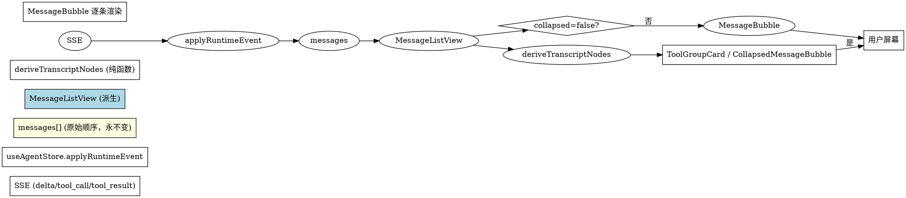

# zai Transcript Collapse — Design

> **Spec for**: zai — Agent transcript 折叠 + 工具组合并(UI 层)
> **Date**: 2026-07-20
> **Status**: Draft (awaiting user review)

## 1. 概述与背景

### 1.1 问题

zai 的 Agent transcript 中,一次复杂任务经常出现**连续 N 个工具调用**(Read → Bash → Edit → Bash → Read → Edit …)。当前 `MessageBubble` 把每个工具渲染为独立卡片,导致:

- 视觉密度高,长 transcript 很难一眼看出主线(用户文本→ 助手回答→ 又一组工具)
- 用户得手动滚过几十个 `ToolCallRow` 才能看到下一段 assistant 文字
- 滚动卡顿随 transcript 长度恶化(每行 ToolCallRow 都有自己的 state)

### 1.2 目标

提供一个 **"折叠视图"(collapsed transcript)** 模式:

- 连续的工具调用合并为一个 `ToolGroupCard`,可一键展开查看明细
- 文本消息(用户输入、助手回答)在折叠态做 `line-clamp` 截断,配 "显示更多" 按钮
- 思考块(`assistant.thinking`)始终完整、不折叠、不截断
- 折叠是视图层派生,**不破坏** `messages[]` 原始数据、SSE 事件契约、transcript v2 落盘格式
- 切换折叠 / 展开是个**全局 toggle**(不写 localStorage,刷新归零),用户明确选"仅本次会话"

### 1.3 决策汇总(经 brainstorming 确认)

| 决策项 | 决定 |
|---|---|
| 折叠方案 | **方案 A — 折叠组 + 工具组合并** |
| 触发方式 | Header 加按钮(默认 false) |
| 持久化 | zustand 内存,刷新归零,切 session 不重置 |
| 思考块处理 | 始终完整,不合并不 clamp |
| 文字截断 | 折叠态 user text 6 行 + "显示更多";**思考块不限** |
| Tool Group 颗粒度 | 连续工具自动合成;1 个也展示为 1 个工具卡片(视觉一致) |
| 错误展示 | ToolGroupCard 标题角标"5 个工具(1 个失败)",展开仍保留红条 |
| Streaming 中切换 | 允许,失去滚动位置(派生树结构变化,接受) |
| 实现路径 | zai 内部实现,**UI 派生层 + 1 个 store 字段** |
| 测试范围 | `deriveTranscriptNodes` 纯函数 9 case 单元测试;不写 RTL |

## 2. 架构

### 2.1 总体思路

store 只增加 1 个布尔 `transcriptCollapsed`(全局,不持久化)。新增 `MessageListView` 派生组件,在 `collapsed=true` 时**动态扫描** `messages[]`,把相邻的工具块合成虚拟 `ToolGroupNode` 渲染。原始 `messages` 永远不变。

### 2.2 渲染管线

```
useAgentStore(s => s.messages, s => s.transcriptCollapsed)
       │
       ▼
MessageListView(messages, collapsed)  ← 新组件,纯派生
       │
       ├─ collapsed=false → 直接 map → <MessageBubble> (现状)
       │
       └─ collapsed=true  → 切节点序列:
            [TextNode,
             ToolGroupNode(start=2, end=5, [Bash, Read, Edit, Write]),
             TextNode,
             ToolGroupNode(start=8, end=8, [Bash])]
            → 各自渲染 <CollapsedMessageBubble> 或 <ToolGroupCard>
```

### 2.3 扫描规则(确定性的纯函数)

- 工具节点 = 满足以下任一类型的 `messages[i]`:
  - `tool_use:start`
  - `tool_use:done`
  - `tool_use:error`
  - `tool_use:invalid`
  - `tool_use:denied`
- 文本节点 = 用户文本 / 助手文本 / `compact_boundary` / `AskUserQuestion` card(独立通道)
- 思考节点 = `assistant.thinking` 或含 `thinking_delta` 的 assistant message(pass-through,不进 group)
- **连续工具节点** = 在 messages 索引上相邻(中间无文本节点、思考节点、AskUserQuestion 切割)的工具节点集合
- 单工具集合也展示为"1 个工具调用"卡片(保持视觉一致)
- AskUserQuestion 始终独立展示,**不**进 ToolGroup

### 2.4 文件布局

**新增**:

| 文件 | 职责 |
|---|---|
| `web/src/components/transcript/deriveTranscriptNodes.ts` | 纯函数 `deriveTranscriptNodes(messages): TranscriptNode[]`,无 React,无 store。**Unit-testable** |
| `web/src/components/transcript/MessageListView.tsx` | 取代 `Agent.tsx` 的 `.map(m => <MessageBubble ...>)` 循环,根据 `collapsed` 路由到 collapsed/expanded 分支 |
| `web/src/components/transcript/MessageBubble.tsx` | 抽出原 `Agent.tsx` 内的 `renderContent` JSX,纯展示,**不**订阅 collapsed state |
| `web/src/components/transcript/ToolGroupCard.tsx` | 折叠态工具组卡片:标题行("N 个工具调用 · Bash/Read/Edit +2"),展开按原顺序平铺 `<ToolCallRow>` |
| `web/src/components/transcript/CollapsedMessageBubble.tsx` | 折叠态单 message 文本卡(隐藏助手思考块和工具行,只保留文本 + `tool_use:error` 红条),`line-clamp` 默认 6 行 |

**修改**:

- `web/src/pages/Agent.tsx` — 删掉 `renderContent()` 那个大 switch(原 `Agent.tsx:1081-1155`),改 `<MessageListView messages={messages} />`
- `web/src/store/useAgentStore.ts` — 加 `transcriptCollapsed:boolean` + `toggleTranscriptCollapsed`;不调 `setMessages`,不动 schema
- `web/src/components/AgentHeader.tsx`(或同位置工具条)— 加 `<Button>` Collapsed toggle

### 2.5 Store 改动

```ts
// useAgentStore.ts 新增字段
transcriptCollapsed: boolean;            // 默认 false
toggleTranscriptCollapsed: () => void;  // 在 store creator 内实现
```

不持久化(zustand 默认内存);不订阅 `persist` middleware;切 session 不重置;刷新归零(同 zai 现有 toggle 行为)。

```ts
// MessageListView.tsx 内的精确订阅
const messages = useAgentStore(s => s.messages)
const collapsed = useAgentStore(s => s.transcriptCollapsed)
```

## 3. 组件契约

### 3.1 `deriveTranscriptNodes` 纯函数

```ts
export type TranscriptNode =
  | { kind: 'text'; messages: ChatMessage[]; startIndex: number; endIndex: number }
  | { kind: 'toolGroup'; toolCalls: ToolGroupEntry[]; startIndex: number; endIndex: number }
  | { kind: 'thinking'; message: ChatMessage; index: number }
  | { kind: 'ask'; message: ChatMessage; index: number }; // AskUserQuestion 独立

export type ToolGroupEntry = {
  message: ChatMessage;
  index: number;
  status: 'pending' | 'done' | 'error' | 'invalid' | 'denied';
}

export function deriveTranscriptNodes(
  messages: ChatMessage[]
): TranscriptNode[];
```

输入:`messages[]`(`useAgentStore` 中持有的原始数组,只读)
输出:节点序列;`messages.length === 0` 返回 `[]`
副作用:无

### 3.2 `MessageListView`

```ts
interface Props {
  messages: ChatMessage[];
}
```

内部:

- `messages` + `transcriptCollapsed` 都通过 zustand selector 拿
- `collapsed=false` → 直接 `<MessageListViewExpanded>`
- `collapsed=true` → 调 `deriveTranscriptNodes`,路由到 `ToolGroupCard` / `CollapsedMessageBubble` / 思考 pass-through
- **key 策略**:`collapsed` 切换时 React 复用同一组件实例(只换 prop),`message.id`(现有)继续作为子节点 key

### 3.3 `ToolGroupCard`

```ts
interface Props {
  entries: ToolGroupEntry[];  // 至少 1 个
  onExpand?: () => void;      // 受控展开(默认不传,组件内自管)
}
```

**视觉(默认折叠态)**:
- 标题行:`"5 个工具调用"` + 工具名摘要(`Bash, Read, Edit +2`)
- 失败角标:`tool_use:error` / `:invalid` / `:denied` 命中时角标红色"N 个失败"
- 主按钮"展开 N 个工具"点击后展开
- 展开后按原 messages 顺序平铺 `<ToolCallRow>`(用现有的 `ToolCallRow` 组件,不重写)

**视觉(展开态 / 仅当 group=1 时)**:
- 单工具也展示"1 个工具调用 · Bash",不特殊化(避免突变样式)

### 3.4 `CollapsedMessageBubble`

```ts
interface Props {
  message: ChatMessage;
  defaultClampLines?: number;  // 默认 6
}
```

- 用户文本:`line-clamp:6` + "显示更多"(展开后保留展开状态,SSE push 新消息后该条不再回缩)
- 助手文本:同样 6 行 clamp,内嵌 `<div data-thinking="hidden">` 隐藏思考块
- `tool_use:error` 红条**保留可见**(若消息带 error 字段则不被 clamp 隐藏,单独 stripe)
- `compact_boundary` 一类按文本处理
- 图片 / multimodal 内容 pass-through,不破坏

### 3.5 `MessageBubble`(新组件,Agent.tsx 抽出)

```ts
interface Props {
  message: ChatMessage;
}
```

包含原 Agent.tsx 中 `renderContent` 全部分支。**不订阅** `transcriptCollapsed`,所以切换折叠不会重建此组件。

## 4. 数据流



### 4.1 三条关键不变量

1. **`messages[]` 只增不减** — store reducer 只 push,不删不改。折叠切换完全靠 `deriveTranscriptNodes` 派生,**不重写数据**
2. **`collapsed` 切换不改 DOM key** — 折叠/展开时 React 复用同一个组件实例,只换 prop(`isCollapsed`)。用户之前看到的视口位置自然可能丢(因为 group 内 tool 排版变化),可接受
3. **派生函数稳定** — `deriveTranscriptNodes` 引用透明(`messages` 引用变才重算),zustand selector 按 messages 引用订阅避免无效重渲染

### 4.2 Toggle 触发路径(`AgentHeader.tsx`)

```
Button(onClick) → useAgentStore.getState().toggleTranscriptCollapsed()
                                │
                                ├─ zustand set({transcriptCollapsed: !x})
                                └─ 全局订阅组件 re-render
                                   (只有 MessageListView 一个真订阅者)
```

### 4.3 SSE 高频场景(delta 流)

- 工具还未 `:done` 时,`messages` 里没该 tool 块;`deriveTranscriptNodes` 只在**已完成**的工具节点上合成 group
- 折叠态用户看到"工具调用中…"loading 占位,完成后 flat 进 group
- **正在流的工具不与下一组合并**(等 `:done` 收尾才参与 group 边界判定)

## 5. 状态机与边界情况

| 边界 | 行为 |
|---|---|
| 流式中(tool 还没 `:done`) | 折叠态下渲染 `ToolGroupCard`,内含当前未完成工具 + loading spinner;**正在流的不与下一组合并** |
| **思考块**(`assistant.thinking`) | 折叠/展开都**完整渲染**,不合并、不 clamp、不折叠 |
| `tool_use:error` 红条 | 折叠态 ToolGroupCard 标题行角标 "N 个工具(1 个失败)";展开态保留红条 |
| AskUserQuestion | 折叠态**始终展开**,不 clamp、不进 ToolGroup(独立通道,语义特殊) |
| `compact_boundary` | pass-through,按文本处理,渲染为单独 TextNode |
| 单工具组 | "1 个工具调用 · Bash",不特殊化(避免突变样式) |
| 空 messages | 渲染空,不报错 |
| 切 session | toggle 状态**保留**,messages 重置(切的是 messages 不是 collapsed) |
| 刷新页面 | toggle **归零**(store 不持久化) |
| Streaming 中切换 collapsed | 允许,滚动位置不强制保留(派生树结构变化大,接受失去位置) |
| 超长 user text(>20k 字) | 折叠态放大至 6 行 + "显示更多";折叠态具体行数由 `CollapsedMessageBubble` 的 `defaultClampLines` 控制 |
| Tool 结果含图片(multimodal) | pass-through,不因折叠破坏图片预览 |
| TodoWrite tool call | 折叠态依然合并进 ToolGroupCard;展开态与原 ToolCallRow 行为一致 |
| v2 TaskList 抽屉 | 不受影响(独立 `useAppStore` + `useBackgroundTasks` 通道) |

### 5.1 toggle 语义

| 场景 | toggle 行为 |
|---|---|
| 启动新 server | false(默认) |
| 同一 session 内点 toggle | 切换并保持 |
| 切 session | 保留(因为是全局布尔) |
| 刷新页面 | false |
| 退 server 重启 | false |

文档明确标 **"仅本次会话(刷新后归零)"** 避免用户对持久化的错觉。

### 5.2 Toggle button 位置

- Header 工具条(与现有 Reset / Copy 一行),左侧
- `transcriptCollapsed=false` → 显示 `ExpandOutlined` 图标,hover 提示 "折叠 transcript"
- `transcriptCollapsed=true` → 显示 `CompressOutlined` 图标,hover 提示 "展开 transcript"
- 单一按钮,无 confirm,无 modal

## 6. 错误处理

| 场景 | 处理 |
|---|---|
| `deriveTranscriptNodes` 抛异常 | 在 `MessageListView` 内部用 try/catch + console.error,fallback 到 expanded 渲染(等同 `collapsed=false`)。现有 Agent.tsx 无 ErrorBoundary 包裹,沿用同样标准;**不**额外引入 ErrorBoundary lib |
| ToolGroupCard 内某 ToolCallRow 抛异常 | 沿用现状(无 ErrorBoundary),React 默认 error 上抛;给出"该工具渲染失败,折叠/展开刷新可恢复"建议 |
| Unknown `message.type`(新加类型且 derive 未识别) | `deriveTranscriptNodes` 默认归到 `kind:'text'`,wrapped 进 TextNode 兜底渲染,无遗漏 |
| `transcriptCollapsed` state 损坏 | zustand 默认 boolean,无 type 风险;万一 `set({transcriptCollapsed: 'foo' as any})`,视图层 `!!x` 兜底 |
| 切 session 后 messages 尚未就绪 | `<MessageListView messages={[]}>` 渲染空,等价 expanded 空态 |
| SSE 断流 / 重连 | `messages` 状态由 server 完成恢复,collapse 状态不参与;不需特殊处理 |

## 7. 测试策略

### 7.1 单元测试(`vitest`,无 DOM,无 store)

**`web/test/transcript/deriveTranscriptNodes.test.ts`** — 9 case:

| # | 输入 | 期望 |
|---|---|---|
| 1 | 单条 user text | `[TextNode]` |
| 2 | 单条 assistant text | `[TextNode]` |
| 3 | 用户文本 → 1 个 tool use → 工具结果 | `[TextNode, ToolGroupNode(start=1,end=2,len=1), TextNode]` |
| 4 | 用户文本 → **3 个连续工具** → 用户文本 | `[TextNode, ToolGroupNode(len=3), TextNode]` |
| 5 | 用户文本 → 工具组 → **thinking 块** → 用户文本 | `[TextNode, ToolGroupNode, ThinkingNode, TextNode]` |
| 6 | 流式未完成(只剩 `:start` 没有 `:done`) | 工具组**包含** `isLoading=true` 标记,与其他组合并仍按边界 |
| 7 | `tool_use:error` | ToolGroupNode 标题 `"3 个工具(1 个失败)"`,角标 badge |
| 8 | `compact_boundary` 块 | pass-through 作为单独 TextNode |
| 9 | 空数组 | `[]` |

### 7.2 集成

不写 RTL,遵循 zai 现有 vitest 单元测试约定。zustand selector 行为靠 TypeScript 类型保证。

### 7.3 Smoke 脚本(可选)

`scripts/smoke-transcript-collapse.ts` — 喂固定 transcript fixture 给 `deriveTranscriptNodes`,打印节点计数+分组表,人工对照。

### 7.4 覆盖目标

- `deriveTranscriptNodes`:**100% line + branch**(纯函数,易测)
- `MessageListView`:**≥ 70% line**(Visual snapshot test 不在 spec 范围内,留给将来)

### 7.5 验证命令

```bash
cd packages/zai && pnpm test deriveTranscriptNodes  # vitest
cd packages/zai && pnpm typecheck                       # tsc --noEmit
cd packages/zai && pnpm lint                            # eslint
```

## 8. 实现路径与里程碑

### 8.1 任务(将由 writing-plans skill 展开)

| # | 任务 | 依赖 |
|---|---|---|
| 1 | 写 `deriveTranscriptNodes` 纯函数 + 9 case 单元测试 | — |
| 2 | store 加 `transcriptCollapsed` + `toggleTranscriptCollapsed` | — |
| 3 | 抽 `MessageBubble` 组件从 `Agent.tsx` | — |
| 4 | 实现 `ToolGroupCard` + `CollapsedMessageBubble` | 1, 3 |
| 5 | 实现 `MessageListView`(collapsed 路由) | 1, 3, 4 |
| 6 | 在 `AgentHeader.tsx` 加 toggle button | 2, 5 |
| 7 | 把 `Agent.tsx` 的 `.map(m => <MessageBubble ...>)` 改成 `<MessageListView>` | 5 |
| 8 | 跑 typecheck / lint / vitest 验证 | 1-7 |

### 8.2 风险与缓解

| 风险 | 缓解 |
|---|---|
| `Agent.tsx:renderContent` 大块逻辑抽到 `MessageBubble` 后漏分支 | spec §7 单测 + 视觉对照(先 expanded 视图手验一致再切换) |
| zustand selector 不够细导致 toggle 触发整树 re-render | spec §4.1 三个订阅切片确定;profile 实测 |
| `deriveTranscriptNodes` 的 messages 类型与 store 实际类型不一致 | 共享 `ChatMessage` type,优先用 zustand 内的导出 type |
| Thinking 与 tool 在 source-of-truth 上争用导致 pass-through 漏判 | case 5 测试覆盖 + 显式 `kind:'thinking'` 优先级高于 `'text'` |

## 9. 范围之外(不做)

- ❌ 多档折叠档位(只做二元 `collapsed:true/false`,YAGNI)
- ❌ 默认折叠 / 默认展开的 user 设置(只有 toggle 按钮)
- ❌ 把折叠偏好持久化到 localStorage / settings.json
- ❌ Tool 内部按类型折叠(如"5 个 Read 合并")
- ❌ Search / jump-to-tool(独立 feature)
- ❌ 把 transcript collapse 抽到 OpenCC 上游(本次 zai only)
- ❌ 折叠态下 thinking / AskUserQuestion 折叠(明确不做)

## 10. 验收标准

1. 折叠态下,连续 3 个以上 tool 渲染为单个 `ToolGroupCard`(用户能看到 `"5 个工具调用 · Bash, Read +3"`)
2. 折叠态下,文本消息被 `line-clamp:6` 截断并附 "显示更多" 按钮
3. 折叠态下,`assistant.thinking` 完整、不截断、不合并
4. 折叠态下,`tool_use:error` 红色角标可见
5. 折叠态下,AskUserQuestion 始终展开,不被 clamp 或合并
6. Toggle 按钮在 Header 可见,点击切换折叠 / 展开无延迟
7. 折叠 / 展开切换不破坏 `messages[]` 数据、不改变 SSE 行为、不影响 transcript v2 落盘
8. 9 个 deriveTranscriptNodes 单测全部通过
9. `pnpm typecheck && pnpm lint` 无错
10. expanded 视图(collapsed=false)与改动前**视觉完全一致**(无回归)

---

> **审批状态**:Draft,等待用户确认 spec 后进入 writing-plans 阶段。
